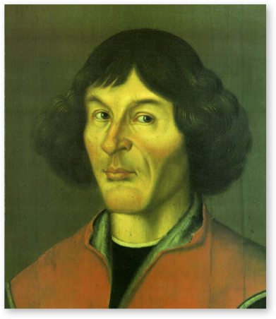
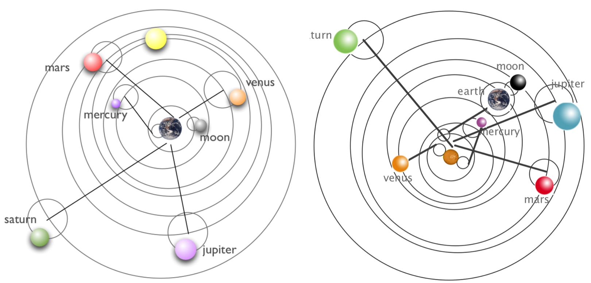

------------------------------------------------------------------------

# Skinny Tycho and Kepler Cosmology

Skinny Physics is meant to be a lightweight (skinny, after all) presentation of some physics that might help you appreciate some of the posts in **QS&BB.** Maybe you've had a course in your past and maybe not, so this chapter has some bare bones (skinny, after all) **facts about Tycho and Kepler Cosmology.**

So: three sections:

1.  Some ideas you might not have had in a previous course ("**Different way**") 😎. Better read this.

2.  Just a bare listing of some **Tycho and Kepler Cosmology** 🎯.

3.  ...and, a bit of **gentle background** behind those facts 🐇.

    (If you'd like more, then visit the [full textbook](https://qstbb.pa.msu.edu/storage/ISP220_fall2020/QS&BB2020/intro.html) presentation.)

## Different way 😎:

::: {.callout-important icon="false"}
🫵 There are some myths about the Sun-centered solution to the solary system arrangements.
:::

1.  We were all taught that Copernicus solved the problem of how the planets moved in the solar system: Sun at center, planets orbiting in prefect circles. Nope. @sec-scattering
2.  By the time of the Renaissance, the Catholic Church was not at war with science. St Thomas had found a path to explore nature and still preserve the Catholic faith and among the best and most imaginative of scientists of the period were Jesuits.
3.  Copernicus worked for the Church and enjoyed considerable support for his work.
4.  Galileo caused his own problems with the Church because he couldn't keep his mouth shut.
5.  Galileo was not tortured. He lived comfortably during his trial. The vote was split.

## Just the facts 🎯:

::: {.callout-important icon="false"}
**Facts from Skinny Renaissance Cosmology**
:::

See [the facts list about the Sun, Moon, and planets in the Skinny Ancient Cosmology chapter](./ancient_cosmology_1.qmd)

**Facts from Skinny Renaissance Cosmology**

-   The first working (gave right answers to predicted planetary positions at any time) model of the universe was due to the Greek, Roman, Egyptian Claudius Ptolemaios (“Ptolemy”) of Alexandria (approximately 90 CE – 168 CE). His epicycular model was just a calculational tool, not necessarily a model that matched what planets actually do. [Review the Ptolemy model in Skinny Ancient Cosmology](./ancient_cosmology_1.qmd).

-   Copernicus' model of the universe placed the Sun at the center with the planets all orbiting in perfectly circular orbits in the planetary order that we know today. There are caveats (see below)

-   Kepler's three conclusions based on fitting Mars data:

    1.  **The law of Orbits:** All planets move in *elliptical orbits* with the sun at one focus.
    2.  **The law of Areas: A** line that connects a planet to the sun sweeps out equal areas in equal times.
    3.  **The law of Periods:** The square of the period of any planet is proportional to the cube of the semimajor axis of its orbit. This is written just above in a simple proportionality. The planets are truly elliptical, but not very much so that $R$ can be treated as the average radius of the orbit with little error.

The law of periods means:

$$
\begin{equation}
k = \frac{T^2}{R^3}.
\end{equation}
$$

Here, $T$ is the period of the orbit, the time that it takes to complete one revolution. $R$ is the radius of the orbit (average radius for an elliptical trajectory). The proportionality constant depends on the system. If the system is a planet in the solar system, then I will designate it as $k = k_S$, where the "S" refers to the Sun. If the Moon, or any satellite around the Earth, I'd refer to $k=k_E$ . These two constants are not the same, but they are the same value for all of the orbiting objects in the two systems.

## Anchors to topics ⚓️:

::: {.callout-tip icon="false"}
🔐 Bottom line sections with stuff to remember in this chapter:

-   Greeks @sec-greeks

-   Ptolemy @sec-ptolemy

-   the set of equations for 1-dimensional motion @sec-equationsofmotion

-   2 dimensional motion: projectiles @sec-projectiles
:::

## Gentle explanations of Early Cosmology 🐇

Many credit the major Scientific Revolution to Copernicus' modeling of the solar system, his entire life's scientific work.

### The Copernican System {#sec-copernicus}

#### Copernicus

The Renaissance and the rise of humanism brought with them a freedom of thinking. Universities began to flourish, especially in Italy, Paris, and Oxford. A century before Galileo joined the faculty at Padua, an unassuming Pole also went to Padua to study medicine, for which it was particularly renowned, but similarly to Galileo, he couldn’t shake his fascination for mathematics and astronomy. Nicolaus Copernicus (1473-1543) was sent to Italy by his uncle who was the Bishop of Warmia to study canon law at Bologna but he actually studied in Padua, Rome, Bologna, and Ferrara. While in Bologna, he lived with the faculty astronomer and made many observations with him. (The primary job of a late medieval astronomy professor included teaching mathematics and astrology.) He eventually went on to Padua to study medicine and believe it or not, astrology was an important tool for doctors and so Copernicus was well-prepared. While he obviously had trouble “declaring a major” he did manage to receive his canon law doctorate degree and have sufficient training in medicine that he would be a practicing physician and personal assistant to his uncle for the rest of his benefactor’s life.

::: column-margin
{#fig-copernicus width="80%"}
:::

Copernicus never took vows and so was a lifelong lay-clergyman. He took a mistress and his hobby: was astronomy. He had learned Greek in Italy and slowly began to question the Aristotelian and Ptolemaic pictures, being especially irritated with Ptolemy’s use of the equant, believing that it destroyed the symmetry. He knew of Aristarcus and began to think differently.

What intrigued him was that the order of the planets was arbitrary in the Ptolemaic system—he thought there should be some correlation of motion with the positions of the planets. In the figure above depicting the Aristotelean universe the planets ordering was Moon, Mercury, Venus, Sun, Mars, Saturn, Jupiter, and the stars. Sometimes people put Venus closer to Earth. What he knew however was that the years of each planet were ordered and perhaps the Humanist fascination with the Sun rubbed off on him a little. In any case, he made a stab at suggesting a Sun-centered picture with the planets in the order that we know them now, following the lengths of the years of each as one gets further away from the Sun. His little attempt was written some time before 1514 and distributed to friends and called *Nicolai Copernici de hypothesibus motuum caelestium a se constitutis commentariolus*, a “little commentary,” or *Commentariolus*. In it he lays out his plans in about 40 pages, but not logic. It made it to Rome and and it’s known that Pope Clement VII heard a lecture on it 20 years after its production and was intrigued. It listed Copernicus’ objections and a set of assumptions: basically, the Sun is stationary, the Earth moves around it annually, the Earth rotates on its own axis daily, and that retrograde motion is a natural consequence of the relative orbit of Earth and the other planets.

{#fig-LABEL fig-align="center" width="80%"}

This went okay and high ranking clergy even offered to support him in the production of a more complete book. But there was enough criticism and it seems that Copernicus had thin skin and he waited almost 40 years to write the complete story: *De revolutionibus orbium celestium* (*On the Revolutions of the Celestial Orbs* (orbits)…the densest treatise on spherical geometry, maybe ever.

He came to produce *Revolutionibus* somewhat reluctantly. It took decades. It seems he required an odd companion.

#### His Model

In school you probably learned of the Copernican system of the planets. The Sun in the center of the solar system and the planets all orbiting in perfectly circular orbits. The right-hand figure above is familiar and indeed an image from *Revolutionibus.* In it, he criticizes the Ptolemaic system as a Frankenstein monster of sorts:

> “...the true symmetry of its parts...they have been like someone attempting a portrait by assembling hands, feet, a head and other parts from different sources. These several bits may be well depicted, but they do not fit together to make up a single body. Bearing no genuine relationship to each other, these fragments, joined together, produce a monster rather than a man.” To him, there was no alternative than to order the planets according to the length of their years. “Thus we discover in this orderly arrangement the marvelous symmetry of the universe and a firm harmonious connection between the motion and the size of the spheres….”

Finally, the Sun, rather than just another orbiting bit takes on a central role:

> “Behold, in the middle of the universe resides the Sun. For who, in this most beautiful Temple, would set this lamp in another or a better place, whence to illumine all things at once? For aptly indeed do some call him the lantern -- and others the visible god, and Sophocles’ Electra, the Watcher of all things. Truly indeed does the Sun, as if seated upon a royal throne, govern his family of planets as they circle about him.”

Circles. Always circles.

::: {.callout-tip icon="false"}
## Wait!  

🤨 **Wait:** We all learned that the orbits of the planets are not perfect circles, but the orbits are elliptical in shape. How did Copernicus get away with circles?    😎 **Glad you asked:** He couldn’t! In fact, he required the use of epicyles as well as Ptolemy. His were not around deferents that went around the Earth, but rather the Sun. But clearly, he could not make circles work by themselves.
:::

\`\`\`{admonition} Pens out! :class: warning But Copernicus needed help with his circles and that came in the form of as many epicycles as Ptolemy!

::: {.callout-note icon="false"}
📝 Copernicus needed help with his circles and that came in the form of as many epicycles as Ptolemy!
:::

Was Copernicus afraid of the Church? Not really. Remember, he had supporters and he was respected in the Vatican. He dedicated *Revolutionibus* to Pope Paul III! Things got bad for Copernicus' work long after he had left the scene...and after the Vatican home-office decided to reboot and reassert its dominance in opposition to Protestantism and the general corruption of its far-flung clerical satellite offices.

{#fig-cop_epi fig-align="center" width="100%"}

When he finished the work, his assistant had to leave to go back to his home university. He took the manuscript with him, intending to drop it off at the publisher in Nürnberg, but left oversight with another Lutheran minister, Andreas Osiander, a dabbler in mathematics and familiar with this kind of publishing.

Protestant Osiander had been in communication with Copernicus and urged him to not state that the world was the way he presented it, but that his work was just a hypothesis. Catholic Copernicus ignored that advice. But Osiander did Copernicus a dirty trick. He added a preface of his own construction, which was a scandal:

> “Since the astronomer cannot in any way attain true causes, he will adopt whatever suppositions enable the motions to be calculated.... **For hypotheses need not be true nor even probable**. On the contrary, if they provide calculations consistent with the observations, that alone is enough.... Different hypotheses are sometimes offered for one and the same motion (for example, either an eccentric or an epicycle model will explain the Sun’s motion). The astronomer will adopt whichever hypothesis is easier to grasp.... So as far as hypotheses are concerned, let no one expect anything certain from astronomy... lest he accept as truth ideas conceived for another purpose, and depart from this study a greater fool than when he entered it.”

Copernicus surely didn’t know that this had been added to his book as he’d suffered a debilitating stroke and died at the age of 70 on May 24, 1543. The touching legend is that he was presented with the published version on his deathbed, but that’s unsubstantiated.

Where he was buried was a mystery until 2008 when archaeologists found a skeleton under the Frombork Cathedral floor. DNA from grave matched DNA from hair found in a book that Copernicus owned. He was given another funeral in 2010 in the Cathedral, where his grave is now adorned with a handsome replica of the idealized Solar System as we know it today.

Copernicus came along at the right time and in the right place to re-imagine the planets in orbit around the Sun. His arguments were not driven by data -- his model wasn’t more accurate than Ptolemy’s. Rather his argument was basically one of symmetry and philosophy. He thought that Ptolemy had described an ugly circumstance and could not explain the order of the planets.

::: {.callout-important icon="false"}
🫵 Copernicus provided reasons to believe that the planets of our solar system orbit the Sun. He explained their ordering, their periods, their relative distances from the Sun, and a simplified solution to retrograde motion.
:::

You might benefit from <a href="https://qstbb.pa.msu.edu/storage/isp220_video_2019/8_early-cosmology/" target="_blank"> 6.1_cosmology2_copernicus_v1\_.mp4 </a> review and wrap-up of these sections.