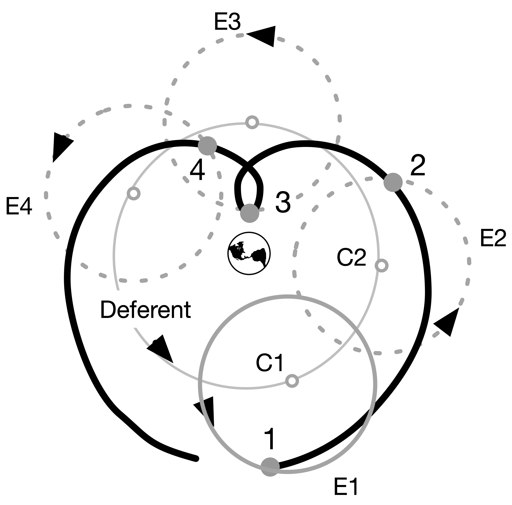
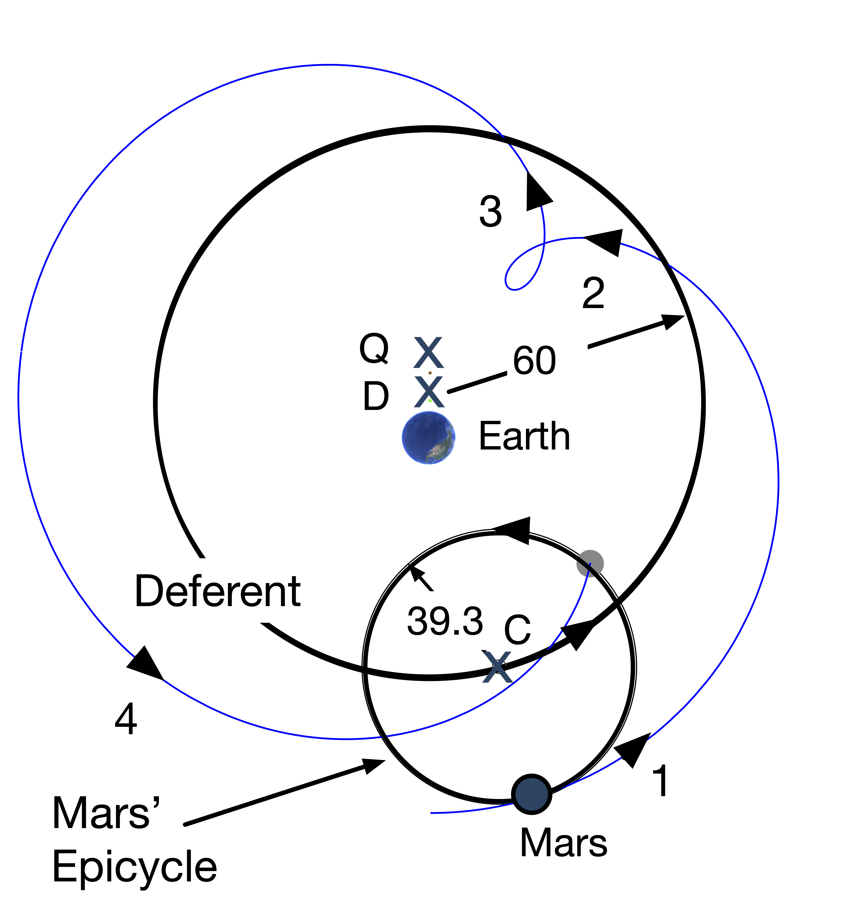

tex--- author: "Chip Brock" number-sections: true date: 2025-08-24 description: "Early Cosmology" draft: false ---

------------------------------------------------------------------------

# Skinny Ancient Cosmology.

Skinny Physics is meant to be a lightweight (skinny, after all) presentation of some physics that might help you appreciate some of the posts in **QS&BB.** Maybe you've had a course in your past and maybe not, so this chapter has some bare bones (skinny, after all) **facts about Ancient Cosmology**.

So: three sections:

1.  Some ideas you might not have had in a previous course ("**Different way**") 😎. Better read this.

2.  Just a bare listing of some **Ancient Cosmology facts** 🎯.

3.  ...and, a bit of **gentle background** behind those facts 🐇.

    (If you'd like more, then visit the [full textbook](https://qstbb.pa.msu.edu/storage/ISP220_fall2020/QS&BB2020/intro.html) presentation.)

## Different way 😎:

::: {.callout-important icon="false"}
🫵 There are some myths about the Earth-centered solution to the solar system arrangement.
:::

1.  The Greeks were very sophisticated in their modeling of the solar system in the Hellenistic[^ancient_cosmology_1-1] and Greek-Egyptian-Roman periods. @sec-scattering
2.  From the Pythagorean period[^ancient_cosmology_1-2] through...well, forever after...everyone know that the Earth was not flat, but spherical.

[^ancient_cosmology_1-1]: The Hellenistic period roughly begins with Alexander the Great's death in 323 BCE when his generals split up his kingdom and established a separate Egyptian-Greek state. It generally ends with Cleopatra's death in 30 BCE, the last of a long line of Greek-Egyptian rulers descended from that first general.

[^ancient_cosmology_1-2]: Around 500 BCE.

## Just the facts 🎯:

**Complete facts about the universe, more than normal for "Just the facts"**

-   The Sun is at the center of the solar system, which is a part of our galaxy, the "Milky Way." Our galaxy is a spiral galaxy with a radius of about 50,000 light years (10kly). There are about 200 billion stars in our galaxy.
-   In turn, the Milky Way is a part of a cluster of galaxies called the "Local Group" which is a group of just under 50 galaxies all bound by gravity to one another in the group. It has a radius of about 5 million light years (5Mly), contains 3 large galaxies (Milky Way \[90kly\], Andromeda M31 \[140kly\], Triangulum Galaxy M33 \[55kly\], 46 dwarf galaxies, and 700 billion stars.
-   The Local Group is gravitationally bound to the Virgo Supercluster 200 galaxy groups, 2500 large galaxies, and 50,000 dwarf galaxies with 200 trillion stars. All within 100Mly in radius.
-   Within a billion light years, there are "walls" of galactic superclusters and enormous voids. There are 100 superclusters in this region and 250,000 trillion stars.
-   The visible universe of 14Bly as a whole contains 10 million superclusters and 25 billion galaxy groups accounting for 30 billion trillion stars.

**Some facts about the solar system**

-   The solar system consists of the Sun and 8 planets and maybe 200 dwarf planets (including Pluto) which are bound to the Sun, but with size and orbital dynamics that are different from the larger 8 planets.
-   Which are: Mercury, Venus, Earth, Mars, Jupiter, Saturn, Uranus, and Neptune.
-   The Earth has 1 satellite (the Moon) but there are 757 other moons in the solary system.
-   There are roughly 4500 comets in the solar system.
-   Before the advent of telescopes, the only planets visible to the naked eye were: Mercury, Venus, Earth, Mars, Jupiter, Saturn, and the ancients included the Moon. This was the inventory before Galileo found four moons of Jupiter.

**Some old observations:**

-   The stars all appear to circle around the Earth as if the Earth were at the center of a great sphere – the "**celestial sphere**."
-   From our Earth-bound perspective, the Sun, Moon, and planets also circle around us as if they're on orbits that the ancients also mentally attached to rotating spheres...which we can see through.
-   The Greeks through Galileo were stuck on the idea that all of the motions of the heavenly bodies follow circular orbits.
-   For 2000 years the Earth was believed by all to be at the center of not only the solar system but the universe as a whole.
-   👉 We know that the Sun is at the center and Earth orbits it every year. The other planets orbit the Sun at different rates – so they have different "years." When the Earth passes by a slower moving planet like Mars, in can appear to be receeding – going backwards relative to the Earth (think about runners on a track with an inside runner passing an outside runner).
    -   From the Earth, this behavior is evident during successive nights. The background stars – those of the 30 billion trillion which we can see – act as a coordinate system of sorts. If Mars is near one star on a night, then each successive night, it will appear to advance towards the East relative to that star. But at some point, the Earth passes Mars and to an Earth-bound observer, Mars appears to go toward the West each night. Then, after weeks, it will regain its Eastward location relative to the stars each night. This is called "**Retrograde Motion**" and was seriously confusing to everyone before Copernicus.
-   The other obseration that the Greeks knew was that the seasons appear to have different durations.

**Facts from Skinny Ancient Cosmology**

The first working (gave right answers to predicted planetary positions at any time) model of the universe was due to the Greek, Roman, Egyptian Claudius Ptolemaios (“Ptolemy”) of Alexandria (approximately 90 CE – 168 CE). His epicycular model was just a calculational tool, not necessarily a model that matched what planets actually do.

## Anchors to topics ⚓️:

::: {.callout-tip icon="false"}
🔐 Bottom line sections with stuff to remember in this chapter:

-   Greeks @sec-greeks

-   Ptolemy @sec-ptolemy

-   the set of equations for 1-dimensional motion @sec-equationsofmotion

-   2 dimensional motion: projectiles @sec-projectiles
:::

## Gentle explanations of **Ancient** Cosmology 🐇

Big subject, this "cosmology" one, limited to the universe and all. SkinnyPhysics isn't the place for a signficant history lesson. But history plays a role about how models of cosmology developted.

### Greeks {#sec-greeks}

What did the Greeks observe? Well, of course they observed essentially the same things that we observe and the same things that the Babylonians and Egyptians observed. The Babylonians had a lot of data, but all they did was describe what they saw. The Greeks were the first to actually try to **explain** what they saw and for them, this was a job for Philosophers and Mathematicians. This is where they were first: using mathematical (meaning: geometrical) arguments to learn facts about the heavens. There were intellectual giants who set themselves on this task from the period between Plato (roughly 425 - 347 BCE) in Athens and Ptolemy (roughly 90 - 168 CE) one of many Alexander the Great's cities called Alexandria...the one in Egypt.

Among their accomplishments were: \* a determination of the radius of the Earth, which was pretty close; \* an understanding of solar eclipses as a near-perfect blocking of the Sun by the Moon; \* an estimate of the distance from the Earth to the Moon ($D_M$) in terms of the radius of the Earth ($R_E$): about, $D_M = ~60 \times R_E$; \* the creation of a very large and sophisticated star catalog, of course just positions of the stars as there were no telescopes.

The Greeks were very clever and invented the idea of not just describing Nature but trying to explain phenomena by interpreting measurements using mathematics. Explanation required some mechanism.

They maintained a commitment, underscored by Aristotle: all motions in the heavens (for Aristotle, beyond the Moon) are uniform angular motions in circular orbits around the Earth. The Earth was the center. The stars are in a sphere outside of Saturn's orbit.

The model that Aristotle created (he was no mathematician and so his "modeling" was simpley descriptive) was built from a complicated set of coupled spheres that had four different axes in order to simulate the daily and annual motions of the planets and also their retrograde behavior. Actually, he stole it from its inventor, Eudoxus of Cnidus (roughly 408 BCE - 355 BCE), a buddy of Plato's. While Eudoxus built models for each of the planets (and Moon and Sun), Aristotle put them all together into one big model of the whole shebang. He required 57 different spheres. (Often called "crystaline spheres" credited to Aristotle, but that's not correct. He never said that. It's a medieval term,)

### Ptolemy {#sec-ptolemy}

The Aristotelian model failed to explain a number of directly observable things:

1.  First, Venus and Mercury seemed to be related to the Sun, always very near it. That seemed hard to understand if the Sun, Mercury, and Venus all rotated around the Earth.

2.  Second, Venus seemed to change its brightness in ways that no other planet did.

3.  Third, some planets appeared to suddenly go backwards!

4.  And fourth, the seasons should have been all the same durations in Aristotle's model (times from solstice to equinox to solstice to equinox)...but they are not the same number of days.

Various modifications were suggested in the second century, BCE, and two mathematical tricks were invented by the brilliant mathematician, Apollonius of Perga (240 BCE – c. 190 BCE). He invented two constructions that might account for some of the above anomalies. The eccentric and eplicycle models.

![Two of Apollonius' constructions for planetary orbits (in this case, the Sun) around the Earth. The left is the "eccentric" model which offsets the center of the orbit by a quantity called the "eccentric, $e$" which is called the "eccentric circle." Notice that the center of the orbit is not where the Earth is located. If the planet is the Sun, then that could explain #1 and #4 above. On the right is the "epicycle" model. Here, the planet orbits a point in space (A) clockwise, which itself orbits the Earth counterclockwise. The little path that the planet takes is called an "epicycle" and the center of the epicycle orbits the Earth on the larger circle (EA) which is called the "deferent." Overlaid is the eccentric model and Apollonius proved that these are geometrically equivalent constructions.](apollonius.png)

What Ptolemy did is reverse the sense of the epicycle rotation to be counterclockwise. That changes everything and causes the planet to execute a loop at a point it its orbit. This is shown in the next figure which follows a planet (►) around the Earth in four different places around the deferent. Notice that ► follows the dashed circle – the epicycle – which itself orbits at a distinct rate about its center which is attached to the deferent at the ○ and which in turn, is also orbiting the Earth itself. The parameters of the epicycle radius, and the rates of rotation of the epicycle and deferent determine the motion of the planet as viewed from the Earth.

Ptolemy fixed the radius of the deferent for each planet to be 60 in aribtrary units and adjusted (like a modern fit) the radii of the epicycles to reproduce what we see. From Babylonian, latter Greek, and his own observations, he fit each planet with 4 points. It's an amazing bit of astrophysics, because full-on astrophysics it was.

The next figure shows Mars using Ptolemy's actual numbers. That value of 39.3 gives Mars' relative positions throughout the Martian year.

{width="80%"}

There are two other features of what Ptolemy had to do to make it provide accurate predictions. Notice that there are three points in space near the Earth which are offset from one another by $e$ , and eccentricity. The distance from Earth to D is $e$ and the deferent circle is centered at D. Then there is another point, which is called the "equant" (Q here) which is also offset from D by $e$. The rate at which the deferent orbits is not uniform relative to D, but is uniform relative to Q. This was the only way he could make it all work.

This is taking huge liberties with Aristotle's requirement that all heavenly objects must execute perfect circular motions and that those motions must be at uniform rates.

If one feeds Ptolemy's model with modern fit parameters...it gives absolutely accurate results today.

👉 If all you care about is turning a mathematical crank and getting predictions that match experiment, then Ptolemy did a great job.

::: {.callout-tip icon="false"}
## Wait!  

🤨 **Wait:** So what's wrong wih that if he got accurate results?    😎 **Glad you asked:** It's not a model of how the planets actually move. That's a modern expectation of a mature physics model and if such a framework works, but seems unlikely to be an actual picture of what the world actually does, then there's probably something good in the model, but it needs work.
:::

Ptolemy wrote his whole system in a huge, complicated book which he called *Syntaxis Mathematica* (now somtimes "*Syntaxis*") and which the Islamic astronomers renamed, *Almagest*, which is a corruption of the Greek term for "greatest." Because it was.

Ptolemy knew that using his complicated tool was a tough assignment and so he later wrote a second book called Handy Tables, which produced specific predictions kinds with tables that a user could read from. A handbook on how to get results and possibly the first example of numerical tables in the history of science.

Then later, he realized that his collection of individual planetary pieces was not a whole universe :::::