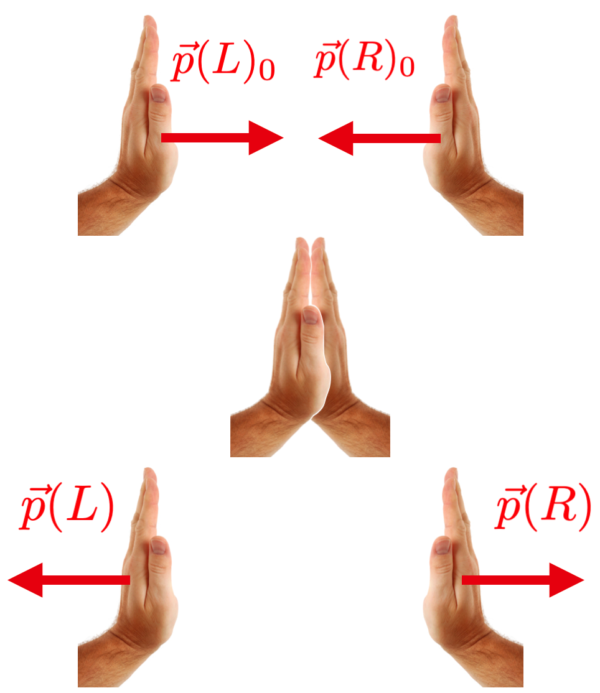
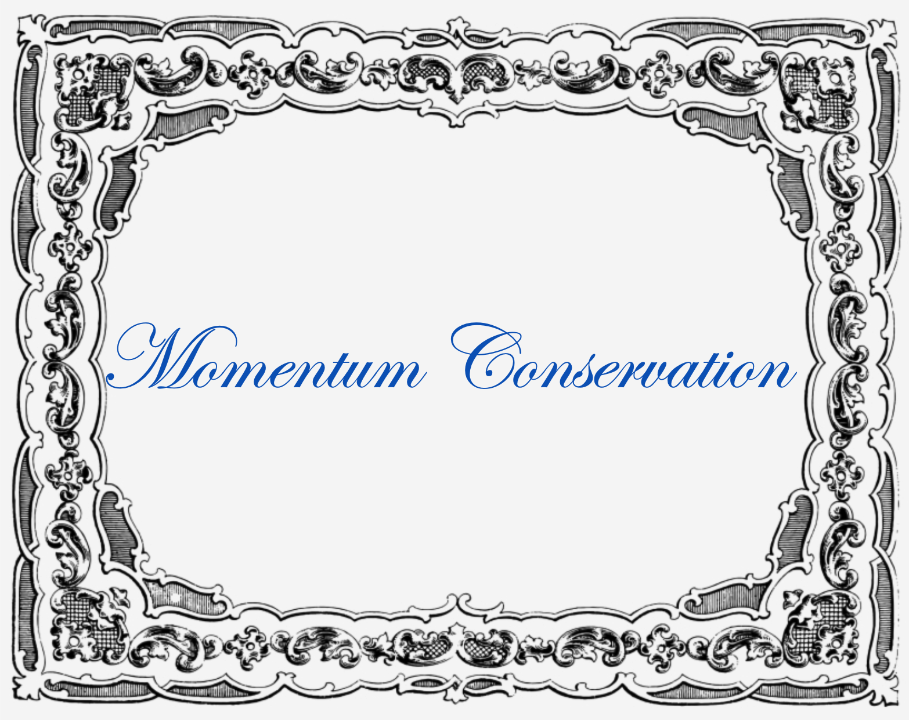
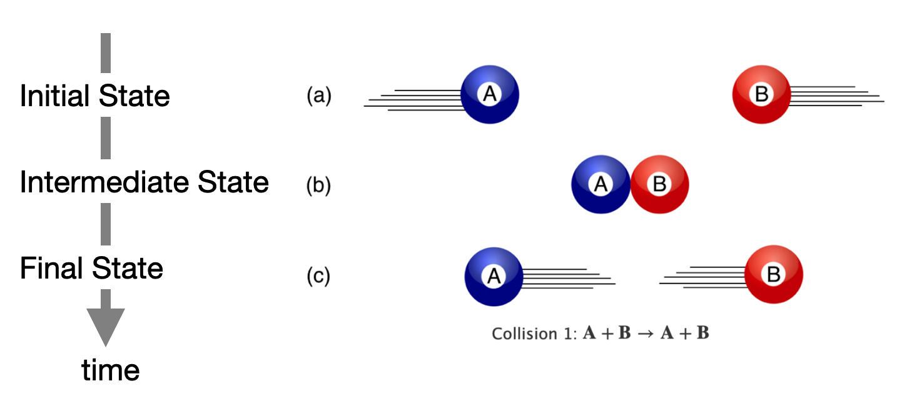
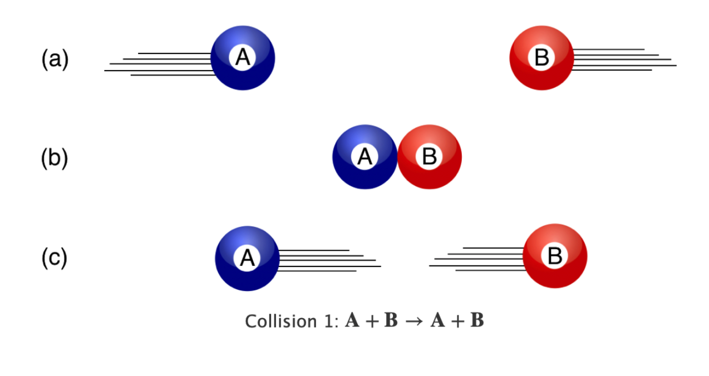
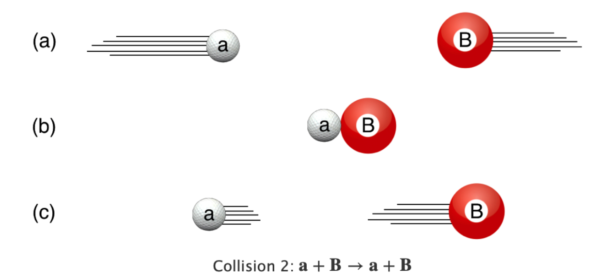
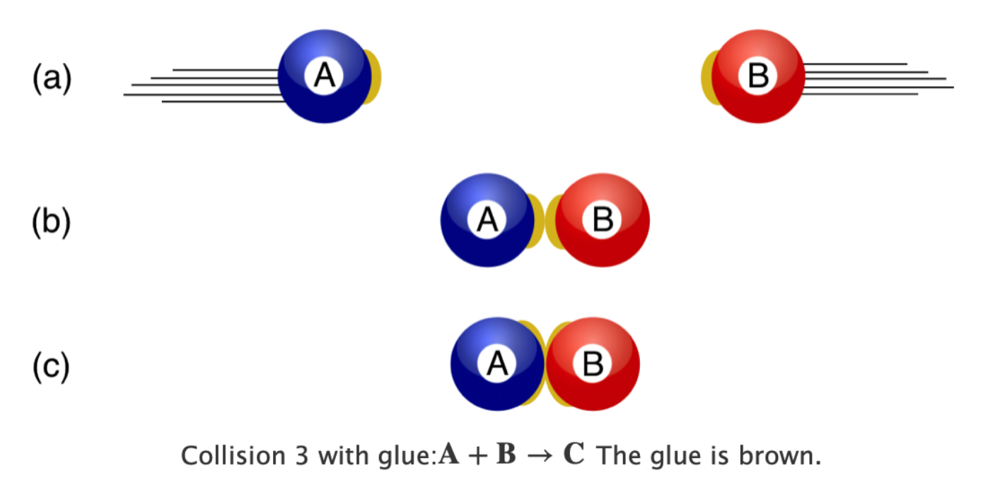
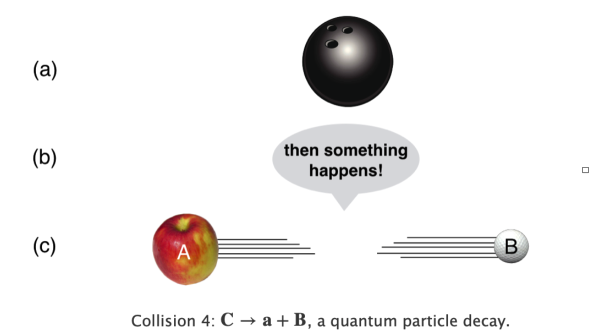
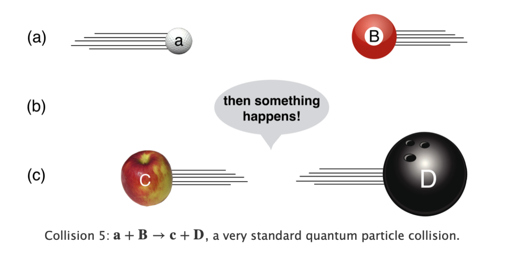

------------------------------------------------------------------------

# Skinny Collisions

Skinny Physics is meant to be a lightweight (skinny, after all) presentation of some physics that might help you appreciate some of the posts in **QS&BB.** Maybe you've had a course in your past and maybe not, so this chapter has some bare bones (skinny, after all) **facts about collisions**.

So: three sections: (1) Some ideas you might not have had in a previous course. ("different way")(2) A listing of some collision facts. And, (3) a bit of gentle background behind those facts. If you'd like more, then visit the [full textbook](https://qstbb.pa.msu.edu/storage/ISP220_fall2020/QS&BB2020/intro.html) presentation.

## Different way

::: {.callout-important icon="false"}
🫵 In a "normal" physics course, collisions are not a huge focus. Here we do particle physics and there are some bizarre interactions that still obey the rules of "billiard balls" but with surprising outcomes.

1.  Scattering interactions, including some [important terminology]{.underline} @sec-scattering
2.  Decay interactions @sec-decay
3.  Production interactions @sec-production
:::

## Just the facts:

### A definition:

When I need to refer to the initial value of some quantity, I'll subscript that quantity with $_0$, like $v_0$. The final value? No subscript.

**A fact: momentum conservation**

Assume two colliding objects, $A$ and $B$ each with momentum $p(A)$ and $p(B)$. They collide with intitial momentum for each of $p_0(A)$ and $p_0(B)$.

$$
\begin{equation}
p_0(A) + p_0(B) = p(A) + p(B) \nonumber 
\end{equation}
$$ {#eq-momconsAB}

The momentum of all components at the beginning is equal to the momentum of all components at the end. Period. That's all we need in this chapter. But it's full of stuff.

## Pointers to topics:

::: {.callout-tip icon="false"}
🔐 Bottom line sections with stuff to remember in this chapter:

-   average speed @sec-averagespeed

-   spacespace and spacetime diagrams @sec-decay

-   the set of equations for 1-dimensional motion @sec-equationsofmotion

-   2 dimensional motion: projectiles @sec-projectiles
:::

## Gentle explanations of Collisions

### Conservation of momentum – a big deal

Remember Impulse? It, with Newton's Third law the key. This idea of "momentum conservation" comes from Isaac Newton, Christiaan Huygens, and Rene Descartes. Let's give them all a hand: 👏 . And after many years of applause, I'll bet you're pretty good at it.

::: {.callout-important icon="false"}
🫵 A conserved quantity in physics is one that is unchanged during a time interval – typically a “before” and “after” some event. These statements are called “ConservationLaws.” There are many but the **Conservation of Momentum** is king of that hill.
:::

Let's manage that clap 👏 so that our identical hands have the same speeds, but they are oppositely-directed. Their velocities are equal and opposite so their momenta are equal and opposite as well. Here's a picture:

{#fig-clap fig-align="center" width="80%"}

Here's the momentum for either one:

$$p(\text{hand}) = m(\text{hand})\times v(\text{hand}).$$

Look at this example in order to see how we construct an important argument based on this laudatory expression of appreciation for our Dutchman, Huygens.

EXAMPLE example_clap_1.md

Get the picture? Based on an analysis of the clap impulse and Newton's third law out of it falls one of the most important rules in physics: **Conservation of Momentum**.

In the example, we started out with the left and right separately, but transformed that picture into the situation of the system (left and right together) at the beginning and the system (left and right together) at the ened. The total momentum of a system – is just the total of all of the momenta in that system. So our momentum flow is:

$$\begin{align*}
\vec{p}(\text{total})_0 &=\vec{p}(\text{left})_0 + \vec{p}(\text{right})_0 =\vec{p}(\text{left}) + \vec{p}(\text{right}) = \vec{p}(\text{total})\\                               
\vec{p}(\text{beginning}) &=\vec{p}(\text{end})   \\
\end{align*}$$ {#eq-momentum_conservation}

In practice the vector symbol $\vec{p}$ means that you first decide what a positive direction is, take away the arrow, and any quantity that points opposite to that positive direction gets a minus sign.

@eq-momentum_conservation was our hand-clap situation and @eq-momconsAB is the more general mathematical statement of Momentum Conservation for any two colliding objects.

## Gentle explanations of Three Kinds of Collisions {#sec-threekinds}

We'll deal with only a few objects in **QS&BB** at any one time and I'll give them names like "1" and "2" or "$A$" and "$B$" and so on...or $L$ and $R$. I'll also need to assign values of velocity, mass, momentum, and so on. Sometimes I'll find it convenient to call object $A$'s momentum to be $p(A)$ and sometimes, $p_A$. It should be obvious and I'll try to take the simplest route.

There are only a few kinds of collisions. And, while I'll maintain this general term, a better term is an "interaction." The context will be clear. I hope. 🙄

### Scattering interactions {#sec-scattering}

Think billiard balls. $$
\mathbf{A}+\mathbf{B}\to \mathbf{A}+\mathbf{B} \nonumber 
$$ {#eq-billiard}

{#fig-LABEL fig-align="center" width="80%"}

Some object (A) collides with some other object (B) and they go on their way. B could be sitting still or A and B could be each moving towards one another. From your experience, you know that whatever motions A and B had before, those motions are now differently shared after. The only way that A and B are totally unscathed or affected is if they didn't actually "interact"...like they were in separate rooms or states or planets, or they went through one another like ghosts. Not very good "collisions" in those silly examples.

"Before" and "After" in collision-land have specific names:

-   The **initial state** of a system is the before.
-   The **final state** of a system is the after.
-   The *intermediate state* of a system is where the action is.

There's more. *At the point of contact something happens* in the middle, **where the physics happens**. For elementary particles, we want to know what happens in that middle state: what models describe as the interaction. For example, it could be electrostatic repulsion.

{fig-align="center" width="80%"}

Here's an animation of such a collision. You can play with it and we'll come back to it in the next chapter. But the initial setup of the animation is the collision of two identical objects (hands?) with the same, but oppositely-directed velocities.

<iframe src="collision-simulation-standalone.html" width="100%" height="480px" style="border:none; border-radius: 8px;">

</iframe>

{#fig-billiard_same fig-align="center" width="80%"}

{fig-align="center" width="80%"}

{fig-align="center" width="80%"}

{fig-align="center" width="100%"}

### Decay interactions {#sec-decay}

Here's another kind, where "collision" might not be the best term, but the rules are the same. $$\mathbf{C}\to \mathbf{A}+ \mathbf{B}$$ {#eq-decay} Here our initial state consists of one thing and the final state consists of two different things. The easiest reaction (that's a good, inclusive term) to visualize is a firecracker, C, that explodes into two fragments, B and C. Where you had a thing now you've got two things.

{fig-align="center" width="80%"}

While that everyday example makes sense, for our purposes, this signifies something quantum mechanical in which case the process is an interaction, but more specifically a *decay*. For example in particle physics there are many examples of an unstable particle that decays into two other particles. We'll create examples using the \[Feynman Diagram techniques\])https://chipbrock.github.io/FeynmanDiagramsEveryone/). For example, a Higgs boson can decay into two electrons. So-called Pi meson can decay into an electron and a neutrino. It goes on.

While I'm on to quantum mechanics processes, there's another kind of scattering that's a little odd.

### Production interactions {#sec-production}

$$\mathbf{A}+\mathbf{B}\to \mathbf{C}+\mathbf{D}$$ {#eq-production}

Think about this. You throw a baseball, A, at a bat, B, and the result of that collision is a beagle and a refrigerator. Same rules apply here as to the previous interactions as to how the dog and the fridge move after the collision, but here and in the decay that "in between" state is where the real action is: the how sports equipment becomes a pet and a home appliance.

So to the motion rules:

{fig-align="center" width="80%"}

##