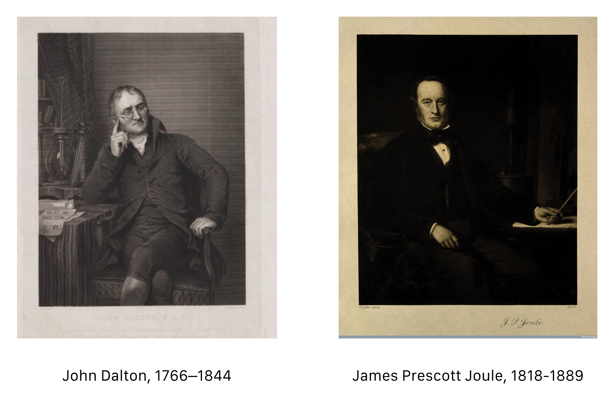
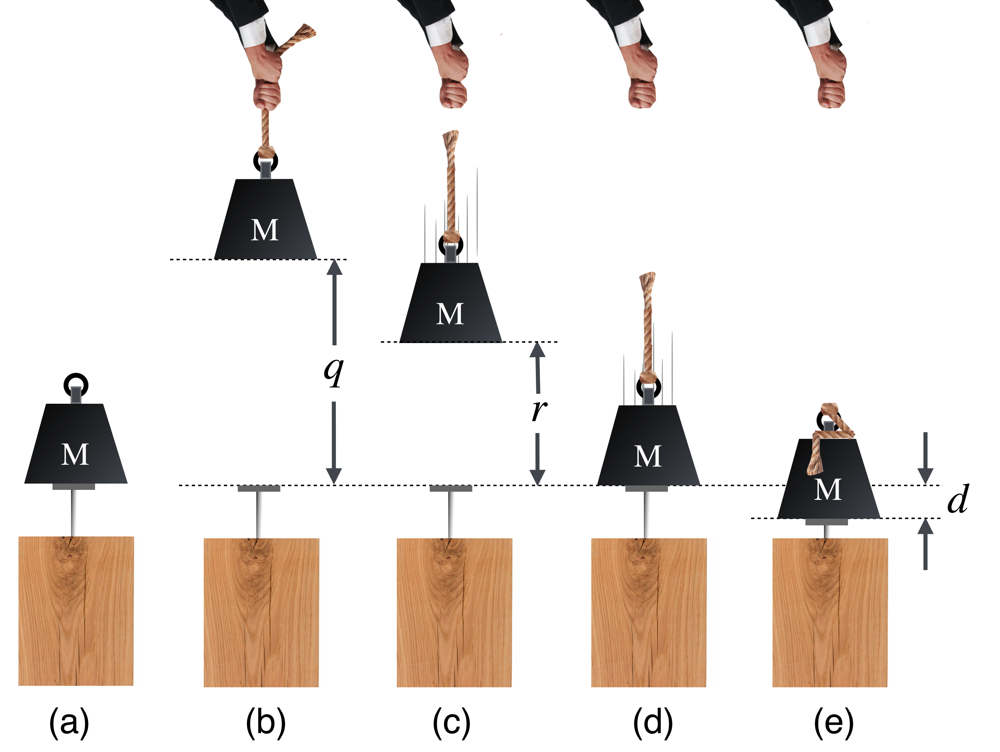
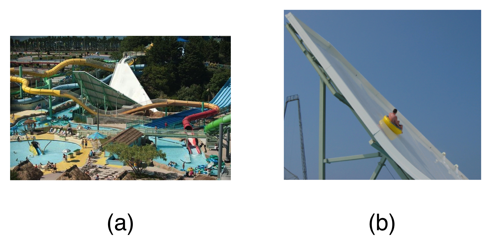
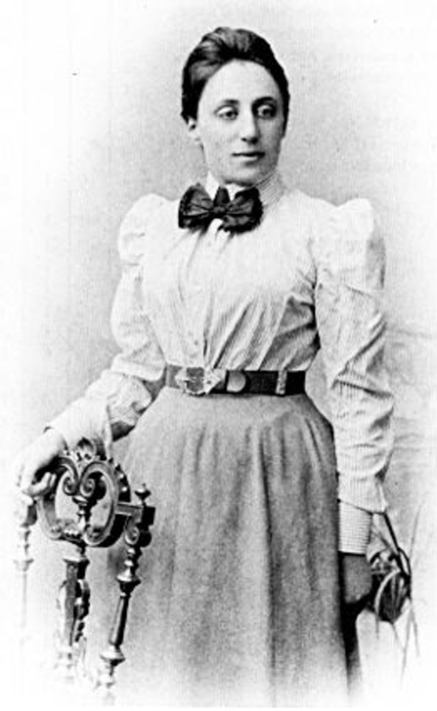
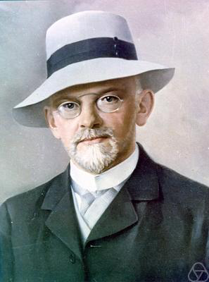
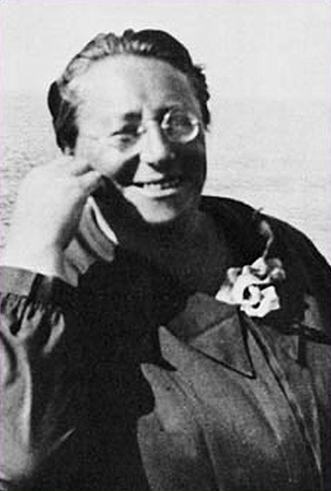

------------------------------------------------------------------------

# Energy {#sec-energy}

> It Just Keeps Going and Going

<p class="message">

"...wherever mechanical force is expended, an exact equivalent of heat is always obtained." James Prescott Joule, August (1843)<br><br> The University of Manchester in that original industrial city has been the home of to-be illustrious physicists as well as already-in-the-textbooks physicists for more than 150 years. Ironically, the Manchester scientist credited with one of the most fundamental statements about the word had nothing to do with the university. He made beer. James Prescott Joule was the son of a brewer who joined the management of the family business in his early 20’s where he launched intensive research into how to increase the efficiency of, or replace its large-scale steam engines. This led to a lifetime of largely private research into the nature of energy.

</p>

## Contents

Energy Conservation {#sec-energy-econservation}

-   [A Little Bit of Joule](@sec-energy-joule)
-   [Ability to Do Damage: Kinetic Energy](@sec-energy-kinetic)
    -   [Kinetic Energy In Practice](@sec-energy-energypractice)
    -   [Classification of Collisions](@sec-energy-classification)
    -   [Let's Talk About Damage](@sec-energy-aboutdamage)
-   [Work](@sec-energy-work)
    -   [Now Let's Explain "Damage"](@sec-energy-explain)
-   [That Stop Shot](@sec-energy-stop)
-   [Energy Conservation](@sec-energy-econservation)
-   [Eager to Do Damage: Potential Energy](@sec-energy-potential)
-   [What Goes In Must Come Out](@sec-energy-inout)
-   [Okay, But What Is It...Really?](@sec-energy-what)
-   [The Exchange of Potential and Kinetic Energies](@sec-energy-exchange)
    -   [Keeping Track of Energies Geometrically](@sec-energy-geometrically)
-   [Energy and Momentum, From 50,000 Feet](@sec-energy-50000)
    -   [Emmy Noether’s Theorem, In A Nutshell](@sec-energy-noether)
-   [What to Remember from Lesson \@sec-energy?](@sec-energy-remember)

<aside class="goals">

Goals of this lesson:

</aside>

I'd like you to Understand:

:   How to calculate kinetic energies of moving objects.

:   How to calculate potential energies of objects.

:   How to use the conservation of energy to calculate speeds. parameters

I'd like you to Appreciate:

:   The importance of the conservation of momentum and energy.

I'd like you to become Familiar With:

:   The novelty of James Joule’s experiments and interpretation.

:   The fundamental importance of Emmy Noether’s work.

------------------------------------------------------------------------

<!-- -------------------------------------------------- -->

## A Little Bit of Joule {#sec-energy-joule}

<!-- -------------------------------------------------- -->

The most famous person in Manchester, England in the 1830s was the quiet John Dalton. An unassuming bachelor, he boarded with the same family for a quarter of a century...while he collected awards from scientific societies from around the world.[^energy-1] We remember Dalton today as the person most responsible for modeling the properties of chemical reactions by imagining atomic structure as composed of molecules, which in turn, he modeled as consisting of atoms. Of course this suggested an unpopular commitment to the reality of the atoms which most were still not prepared to make. But nonetheless, even if not actual bits of reality, his molecular model was a mental organizing picture that proved useful – and of course eventually, the case.

[^energy-1]: His boarding house is now a very nice parking lot in Machester.

Dalton divided his time between personal scientific research and private tutoring which leads us to another reason for our indebtedness: among the students whom he privately tutored was a young James Joule, destined to become the next of a string of famous Manchester scientists that continues to this day.

```{r}
#| label: fig-mancheterboys
#| fig-cap: "Manchester teacher and student."
#| out-width: "68%"
#| echo: false

```

In the 19th century Manchester was an engineering community, the hub of the industrial revolution in Europe and proud of its string of technological "firsts" in engineering, infrastructure, and transportation. Joule fit right into that spirit. Today, if you turn on a baseboard heating strip because you're cold or crank up your air conditioner (or retrieve a cold drink from your refrigerator) because you're hot...you're deploying two of James Joule's most enduring discoveries. About heat. He was the king of heat.

<aside class="marginfigure">

```{r}
#| label: fig-brewery
#| fig-cap: "Still making beer."
#| out-width: "50%"
#| echo: false
knitr::include_graphics("brewery.png")
```

</aside>

Joule grew up in a wealthy family successful because they weren't shy about applying technology to commerce: they made beer.

Joule had an adolescent fascination with electricity, probably influenced by the famous work of Michael Faraday in London. When he and his brother were not (literally!) shocking their family and the household staff, James was beginning to conduct research on what causes heat. Electrical motors had just been invented (we'll learn about Michael Faraday in a bit) and he built several and studied how to improve their efficiencies. What he had going for him were his systematic experimental instincts, the inspiration of his teacher, and...thermometers. Joule developed thermometers capable of measuring temperatures with a precision of 1/20th of a degree.

Brewers knew how to measure temperatures very accurately and very precisely.

> **Precision and Accuracy, and Bill** <br><br> Do you know the difference between precision and accuracy? Here's an example that will help. In the 1980's digital watches were just becoming available and I had a graduate student who was a proud owner of one. The stem on that watch reset the time---to 12:00pm. So every time he moved his wrist, the time on his watch would become noon. Not very useful. <br><br> His watch was very precise...it was digital...but terribly inaccurate...it gave the wrong time. He had no idea what time it was, but he knew that very, very well.

Another thing he had going for him were his family's resources --- his father built him a laboratory and he did publishable research in electrochemistry motivated by Faraday's contemporaneous work in London.

> **Joule heating** <br><br> Bring your hand close to an incandescent light bulb. Hot, right? Where did that heat come from? Joule experimented with motors and one of the first things he attempted was to rid his motors of internal friction and in the course of that practical chore, he started his assault on the prevailing view of the nature of heat. <br><br> For nearly half a century, the notion that heat was a fluid substance ("caloric") that flowed from one object to another. If something got warm, that's because caloric had flowed into it. Your light bulb isn't consistent with that idea --- there's no place for the caloric to have flowed from. It has to be produced from within the filament itself. This is now called Joule Heating, the heat generated when an electrical current flows through a resistive medium. He experimented with electrical, chemical, gaseous, mechanical, and fluid systems comparing energy in...with energy out of each. He suspected a revolutionary connection among all of them.

Want to make beer on a commercial scale? You need to heat up large quantities of water and that's expensive. So the industrialist in Joule led him to a comparison of battery-powered and coal-fired heating elements. After detailed experimentation, he concluded that coal was far more efficient---using up coal was then cheaper than using up the dissolving components of early batteries. His scientific researches were often connected to his business and until he sold the brewery in 1855, he spent part of his day in the affairs of running an industrial-sized company and considerable time with his research.[^energy-2]

[^energy-2]: He also took work home. His neighbors objected mightily to the noise created by the steam engine that he built in his back yard.

<aside class="myaside">

<br>About steam engines. The first railroad in the world was built between Manchester and Liverpool and was innaugurated on September 30th in 1830, when Joule was 12 years old. It must have been memorable to a young boy since one of the dignitaries was actually killed when he fell into the path of one of the trains. <br><br>The Liverpool and Manchester Railway consisted of two sets of tracks which carried people and materials over the 26 miles between the two industrial centers. The trains were powered by steam engines and steam engines were a familiar city sight (and sound). In that textile center of the industrial revolution universe there were more than 50 steam-engine-powered cotton mills at the turn of the 19th century.

</aside>

In Joule's business and his city's lifeblood there was no misunderstanding of how to make mechanical motion on a grand scale: heat water, produce steam, and engineer the steam to move pistons. That is:

-   Heat $\to$ Motion. This was consistent with the caloric idea but the opposite process wasn't necessarily so:

-   Motion $\to$ Heat?

**Could motion make heat?**

This question slowly formed in Joule's mind as he performed experiments on the heating of battery-powered circuit elements and fluids of all sorts. He found a common feature of all of them: a given amount of mechanical motion (turning a crank, or electrical current, letting a weight fall…) would produce the same temperature rise in water or any liquid. His first efforts were comparing a battery-driven (and hence, chemical origin) with a generator (and hence mechanical origin). His results were not well-received. Bored, was the response.

His seminal experiment was to directly heat water, but in a novel way. He suspected and showed that if you stir a fluid, it gets warmer. Not a lot. But Joule had inherited Dalton's idea that a gas was made of atoms (and developed his own theory of gases and the energy of molecules) and that making them move faster was to increase their temperature. He also applied this idea to water. He created a little system sketched by him in Figure \@ref(fig:joulemechanical) with paddles in a beaker of water that could be made to stir the water a specified amount because they were attached to a falling weight. The weight falls a given amount and the paddles reliably turn a specific number of rotations. His experience with precision thermometers allowed him to figure out that a finite amount of stirring could raise the temperature of water by a single degree Centigrade. He reported this result to the British Association in 1845 and published a paper describing his results in the *Philosophical Magazine*.

```{r}
#| label: fig-joulemechanical
#| fig-cap: "He once made a thermometer so precise that he could measure the temperature of moon-light. That is the temperature rise in air lit only by the moon. Here is the device he used to demonstrate that stirring water would heat water. You see the weight on the right and a cross-section of the beaker with water, paddles, and his thermometer."
#| out-width: "68%"
#| echo: false
knitr::include_graphics("joulemechanical.png")
```

He found the same amount of mechanical effort was required to raise the temperature of the water as in his electrical experiments! Excitedly he proposed to report on his work at a scientific meeting in 1847 and was basically told that since nobody really ever cared about his work, that he should keep his remarks very short. He did, but a young audience member asked important questions.

The young man was William Thomson, who was eventually raised to peerage as Lord Kelvin. Today we refer to temperature in units of Kelvin and energy in units of Joules.

> **Home Depot** <br><br> When was the last time you bought a light bulb? Look at the package and you'll maybe see reference to "Light appearance 2700K" ...or "Soft white 2700K" or 2100K or "Daylight 5000K"...these are all temperatures in units of "Kelvin," K, which we'll learn later because of quantum mechanics! Temperature of heated objects directly points to the color (wavelength) that's emitted. Stay tuned.

In particular the *Joule* was designated in 1889, the year James Joule died, memorializing his life's work. In modern language, his earlier mechanical equivalent of heat is that it takes 4.184 Joules of energy to raise 1 cubic centimeter of water one degree Celsius. His measurements were all consistent with this amount.

> "The paddle moved with great resistance in the can of water, so that the weights (each of four pounds) descended at the slow rate of about one foot per second. The height of the pulleys from the ground was twelve yards, and consequently, when the weights had descended through that distance, they had to be wound up again in order to renew the motion of the paddle. After this operation had been repeated sixteen times, the increase of the temperature of the water was ascertained by means of a very sensible and accurate thermometer.<br><br> "A series of nine experiments was performed in the above manner, and nine experiments were made in order to eliminate the cooling or heating effects of the atmosphere. After reducing the result to the capacity for heat of a pound of water, it appeared that for each degree of heat evolved by the friction of water a mechanical power equal to that which can raise a weight of 890 lb. to the height of one foot had been expended." <br><br> *Joule in 1849*

> "I will therefore conclude by considering it as demonstrated by the experiments contained in this paper,<br><br> 1st. That the quantity of heat produced by the friction of bodies, whether solid or liquid, is always proportional to the quantity of force expended. And,<br><br> "2nd. That the quantity of heat capable of increasing the temperature of a pound of water (weighed in vacuo, and taken at between 55° and 60°) by 1° Fahr., requires for its evolution the expenditure of a mechanical force represented by the fall of 772 lbs through the space of 1 foot."<br><br> *Joule in 1850…some refined measurements brought his mechanical equivalent much closer to the modern value.*

<p class="pullquote">

Heat and motion are both forms of energy which can be converted back and forth---and not disappear.

</p>

It is that "back and forth" that has been historically credited to Joule and that's just a colloquial way of saying that *energy is conserved*. What you put into a system by mechanical means, you'll get back in heat and *visa versa*. Nothing's lost. Nothing's spontaneously created. It transforms from one form to another.

Indeed:

> "Nothing can be lost in the operations of nature – no energy can be destroyed."<br><br> *Lord Kelvin, 1847*

> From a similar investigation of all other known physical and chemical processes, we arrive at the conclusion that nature as a whole possesses a store of [energy](#sec-energy), which cannot in any way be either increased or diminished; and that, therefore, the quantity of [energy](#sec-energy) in nature is just as eternal and unalterable as the quantity of matter. Expressed in this form, I have named the general law "the principle of conservation of [energy](#sec-energy)".<br><br> *Hermann Helmholtz, 1847*

Joule married Amelia Grimes in 1847 (who tragically died seven years later after they had two sons and a daughter). Their wedding get-away was in Chamonix, France (near CERN, actually) where together they tried to measure the difference in temperature between water at the top of a waterfall and the bottom. You gotta love that as a scientist’s honeymoon.

Joule was a little isolated while he did much of his work, but increasingly he became more and more well known and well regarded in Europe. Without any formal education, this recognition came slowly but eventually he was elected to Fellowship in the Royal Society in 1850 and received honorary degrees from Dublin, Oxford, and Glasgow. Finally, in 1872, he served as the President of the British Association. Not bad for a brewery lad.

James Joule convinced everyone that heat and work (we’ll see what the formal definition of work is below) are two sides of the same coin: *energy*. That "energy" can be transferred back and forth between heat and work is basically the First law of Thermodynamics and the basis of the world’s industrial economy and many of our household conveniences. It led to the notion of the conservation of energy and guides our thinking to this day. In a lifetime of scientific work, we remember him for first demonstrating that:

$$\begin{align*}
\text{mechanical motion } \to &\text{ heat} \\
\text{ and heat } \to &\text{ mechanical motion:} \\
&\text{ his early notion of energy conservation} \\
\text{gravitational height differences } \to &\text{ heat} \\
\text{electrical resistance } \to &\text{ heat} \\
\end{align*}$$

He even drew on his Dalton influences and began to think of heat as the fast motion of molecules, even contemplating their average speeds.

Joule died in 1889 and is honored forever with his name used as the universal unit of energy: 1 Joule (J) is the equivalent of 1 kg-m$^2/s^2$. We pay our electricity bills according to the number of Watts recorded by your utility provider (it's one of the only everyday metric unit in the U.S.): 1 Watt is 1 Joule per second (J/s), which is *power*. To the people. (See what I did there?)

<!-- -------------------------------------------------- -->

## Ability to Do Damage: Kinetic Energy {#sec-energy-kinetic}

<!-- -------------------------------------------------- -->

Okay. "Ability to Do Damage" isn’t a scientific phrase...but I’ll bet you’ll remember it better than our very specific use of a very regular word: "work." If you want to do damage to something, you initiate some sort of contact with it and speed often figures into that process. Want to demolish something with a hammer? Gently pat it? or swing the hammer at high speed? Want to smash a teapot by dropping a rock onto it? Drop it from high up so it’s moving really fast when it hits. So if you want some damage, you need some speed.

But mass figures in too: a hammer made out of balloons is not a damage-maker and neither is a pebble. So a question is: what’s more important, mass or speed in inflicting damage? This subject is tightly coupled to our favorite collision-topic of momentum.

Let’s go back to high school.

> **Wait.** No! No no no no!<br> **Calm down.** It's just a cheap story device.

Imagine that Principal Crotchety took away the catchers mitts from the boys baseball and girls softball teams, so each catcher must catch a pitched ball with his or her bare hands.

A regulation softball has a mass of about 0.22 kg while a regulation baseball has a mass of just about half of that, 0.145 kg. Here’s the question: An average high school softball pitch is about 50 mph – 10 or 15 mph faster than that, and you’ve got a college pitcher on your hands. But a 50 mph baseball is not so impressive: that's less than batting practice speeds. Consider these two trade-offs, and think about having to bare-hand catch the following:

-   Replace a baseball thrown of 50 mph with a softball of the same speed – a factor of 2 increase in mass, but same speed?

-   Replace a baseball thrown at 50 mph with a baseball thrown at 100 mph – a factor of 2 increase in speed but the same mass?

Which pitch would do proportionally more "damage"---hurt more? I’d take the first example any day.

Our catcher, Herman, is warming up his disappointing, 50 mph pitcher barehanded. After each pitch the baseball would compress and bend his skin, the underlying facia, muscle, and fluids until the ball comes to rest. That compression hurts and blood rushes to start the tissue repair and he'll bruise (that's the…damage). Across the field, Blanche is barehand-catching her terrific pitcher who's throwing 50 mph softballs. She's putting up with more damage to her hands. But while damage was done to both, did either one fall down? Probably not. This comes to the interplay between momentum and "damage" which will become clearer in a bit.

To the best of my knowledge, Galileo wasn't a baseball fan, but he did think about pile-drivers---those devices that transport a large mass into the air and then release it directly over a beam (the pile) that needs to be driven into the ground. He found two interesting things:

-   First, the higher you go to release the weight, the deeper the beam is driven into the ground. But not linearly. Galileo speculated about this (by listening to the sounds of pile drivers). It was measured a century after him in 1720 by Dutch natural scientist Willem Gravesande at Leiden University who dropped balls of different masses on clay. He found that if one drops a mass that it dents the clay landing-spot. No surprise there. If one then doubled the speed just before the impact the result is a dent which was <i>four times</i> deeper than the original. That's suggested in the figure below.

-   Galileo also found that the speed of an object in free-fall increases slower than linearly...if you drop an object from 10 feet and measure the speed at the bottom and compare that to the speed from a drop twice as high you'll find that the speed increases by a factor of $\sqrt{2}$, about 1.4. (Look at Equation \@ref(eq:vax))

-   Finally, Galileo speculated that if you launched an object vertically with an initial speed that's equal to the speed at the ground when it fell from 10 feet, it would rise back to 10 feet. This is also suggested in the figure below.

```{r}
#| label: fig-known
#| fig-cap: "The above list in figures. (a) shows that the higher the fall, the deeper the indentation by the square of the distance. (b) shows that the higher the drop, the faster an object goes by the square of the velocity. And, (c) shows that a ball will return to the original height if shot from below at the speed it would have fallen."
#| out-width: "100%"
#| echo: false
knitr::include_graphics("known.png")
```

Catching a baseball is an $A+B \to C$ type of collision. From your experience, you know that if someone throws you a ball and you catch it, that you're probably not going to be carried backwards at a high speed.

<!-- deeper --------------------->

::: {.penoutdeep markdown="1"}
🔎 Have a look at the first deeper explanation: [Herman's a light weight catcher and if he catches that 50 mph ball, what is his (and the ball's) speed after he catches it?](./examples/energy/deeper_catcher_1.html){target="_blank"} <!--- EXAMPLE --->
:::

<!-- back to normal -------------->

The light baseball slowed from 22 m/s (50 mph) to 0.06 m/s (0.13 mph) when caught by the massive, but slight, Herman.

> **Wait.** This surprises me. Where did all that speed go?<br> **Glad you asked.** In this (perfectly constructed) example, there's only an imperceptible speed after that fast ball hits its target (Herman). Stay with me, and we'll find where the speed went!

<!-- -------------------------------------------------- -->

### Kinetic Energy In Practice {#sec-energy-energypractice}

If there's so little speed transfer, why would that 100 mph baseball hurt so much more than a 50 mph baseball? The hint is in the results from that 1720 clay experiment. You see: when a moving object does damage to a another object, speed matters more than mass, in fact it matters by a lot more.

Since mass and velocity contribute to momentum in equal proportions, "damage" refers to some other quality of motion, different from momentum. We call it Kinetic Energy. We’ll use the symbol $K$ to stand for it and in modern terms, its ability to do damage is related to the square of speed and only one power of mass. Our modern notion (since the late 1800's) came slowly.

<p class="pullquote">

Kinetic Energy, $K$, is the energy that an object has because it's moving.

</p>

One of the remarkable achievements of Huygens, anticipating Newton's concept of mass, was the discovery of a second conserved quantity. In this, Huygens had an eventual partner: Gottfried Leibnitz --- Newton’s bitter rival for the priority of the Calculus --- who independently had the same idea. They both found by calculation and experiment that if you add up all of the quantities: $mv^2$ for all of the objects in a special kind of collision that the total amount of that quantity before is equal to the total amount afterwards…*without regard to direction.* That is, since the velocity is squared this is not a vector quantity, but a scalar one. Just numbers.

Leibnitz inconveniently called this quantity $mv^2$ a "force," in particular the "life force" or *"vis viva."* It's not a force! That's what happens when you're inventing a whole field of thought.

Today (actually, about mid-18th century), a factor of $\dfrac{1}{2}$ is added in order to create the quantity we call:

$$\begin{equation}
\text{Kinetic Energy } K=\dfrac{1}{2} mv^2. 
\end{equation}$$

> **It was Huygens.** <br><br> Here's a story of hurt feelings and over-the-top gentlemanly behavior. Unsatisfied with Descartes' approach to what we now call momentum, Huygens worked out both momentum conservation and kinetic energy conservation some time around 1656, wrote it up, and didn't publish it. But. In a trip to London he told colleagues of his ideas. <br><br> Imagine his surprise when Christopher Wren and John Wallace each submitted papers to the Royal Society (RS) using his ideas---Wren solving the "elastic collision" problem and Wallace solving the "inelastic problem" (Herman's baseball problem). He learned about it because the head of the RS sent the papers to Huygens for comment!<br><br> Although he must have been hurt, Huygens replied by submitting *his* unpublished solutions---in Latin---as his review of their papers. Undeterred, the RS ignored Huygens' manuscript and published Wren's and Wallace's work without mentioning him. Huygens then reduced his solutions to two pages---in French---and submitted *that* to the Royal Society's French publishing competitor. <br><br> That got the attention of the RS which quickly translated Huygens' two pager into Latin and published it in the RS journal with a nearly two page Royal Society Apology. Of course, Huygens then expressed *his* heartfelt appreciation for his foreigner RS membership. Everyone was nice.<br><br> <b>Christiaan Huygens was The Man.</b> Only eclipsed by Isaac Newton, The Other Man.

<!-- -------------------------------------------------- -->

### Classification of Collisions {#sec-energy-classification}

One of the aspects of this that's confusing is that Huygens' conservation only happens in particular kinds of collisions, which I hinted at in the last lesson. If two colliding objects have no parts --- if they're elementary and fundamental --- then, and only then, is $K$ conserved. This means that

$$ K(\text{ for all of the objects before a collision}) = K(\text{ for all of them after the collision}).$$

if the collision is for objects with no parts. Elementary particles. Prefect ones. Collisions of that type are called **elastic**. In everyday life, that's an abstraction. For elementary particles, that's the way it actually is.

> Nothing about our *everyday world* is that way. Everything's got parts! But it is possible to create materials such that when they collide they first, bounce off of one another (not Herman's caught baseball, but more like billiard balls) and second, when they collide they compress very little. In that case, even everyday collisions can be very close to that special kind. We can sometimes thing of these collisions as almost elastic an idealization --- unless you're a particle physicist! When two electrons or protons or any elementary, no-parts-kind-of-object collide, they do so elastically. The defining feature of elastic collisions is that Kinetic Energy is conserved. So in QS&BB, unless I'm trying to make an everyday-sort of point: we'll count on Kinetic Energy conservation.

<p class="pullquote">

You can always count on kinetic energy conservation...but only for elementary particle collisions.

</p>

The damage-producing collisions of the sort that Blanche and Herman dealt with do not conserve Kinetic Energy between the initial and final states of those macroscopic baseball and people objects. Both of which have parts. We call these real-life collisions, "**inelastic**" and the kind of $A+B \to C$ collisions that we talked about with baseballs are the **completely inelastic collisions**. They maximally don't conserve Kinetic Energy!

How about momentum?

<p class="pullquote">

You can always count on momentum conservation.

</p>

To summarize:

-   For **Elastic Collisions**: momentum is conserved and kinetic energy is conserved.

-   For **Inelastic Collisions**: momentum is conserved, but kinetic energy is not conserved.

-   For **Totally Inelastic Collisions**: momentum is conserved and kinetic energy is maximally not conserved.

<!-- -------------------------------------------------- -->

### Let's Talk About Damage {#sec-energy-aboutdamage}

So, to summarize what’s conserved in collisions. For *elastic collisions* between object 1 and object 2 --- say an electron colliding with another electron (or an idealized collision between billiard balls) --- we separately conserve:

$$\begin{align}
\vec{p}_{0}(1)+ \vec{p}_{0}(2) &= \vec{p}(1) + \vec{p}(2) \label{eq-momentumc12} \\ \nonumber \\
 \text{ and }& \nonumber \\ \nonumber \\
\frac{1}{2}m(1) v_{0}^2(1) + \frac{1}{2}  m(2)v_{0}^2(2) &= \frac{1}{2} m(1) v^2(1) + \frac{1}{2} m(2)v^2(2). \label{eq-energyc12}
\end{align}$$

Here $v_{0}(1)$ and $m(1)$ are the initial velocity and mass of object 1 and $v(1)$ is the final velocity of object 1, and so-on for object 2.

The first equation is the Conservation of Momentum, a vector equation and the second is the Conservation of Kinetic Energy appropriate for elastic collisions.

<p class="pullquote">

Both momentum and kinetic energy are separately conserved in all elastic scattering processes.

</p>

If any object is moving, it has kinetic energy. If not, then it doesn't. So what happens when our baseball is caught? Let's calculate the kinetic energy of that 50 mph baseball and then the kinetic energy of Herman and the baseball combined.

<!-- write it --------------------->

::: {.penout markdown="1"}
🖋

$$K_0=1/2 m v^2 = 1/2 (0.145 \text{ kg})(22 \text{ m/s})^2 = 35.1 \text{ kg-m$^2$/s$^2$}. \nonumber$$

(Notice that Herman provides no contribution to the initial kinetic energy. He's squatting behind the plate. Nervous, but not moving.)

This is where the fundamental unit of energy comes in: 1 Joule (J) = 1 kg-m$^2$/s$^2$ so our baseball has a kinetic energy of 35.1 J.

Here's the interesting thing: What's Herman's kinetic energy after catching the baseball?

$$K=1/2 m v^2 = 1/2 (54.145 \text{ kg})(0.06 \text{ m/s})^2 = 0.1 \text{ J}.\nonumber$$

What happened? Where did all of that kinetic energy go? From 35.1 to 0.1 J?
:::

<!-- back to normal -------------->

<!-- deeper --------------------->

::: {.penoutdeep markdown="1"}
🔎 Have a look at the second deeper explanation: [We can create a graph that will work for all $A+B \to C$ collisions:](./examples/energy/deeper_fractionK_1.html){target="_blank"} <!--- EXAMPLE --->
:::

<!-- back to normal -------------->

> **Wait.** So all of that large kinetic energy just “disappears”??<br><br> **Glad you asked.** I warned you that kinetic energy is not conserved in inelastic collisions and in the baseball-catcher collision ($A+B \to C$) when two objects become one object is the most **un**-conserved collision of all! But "disappeared" needs some explanation, and that goes along with "damage."

To appreciate this, we need to appropriate an everyday word for a specific, physics-y purpose: **Work**.

<!-- VIDEO -------------------------------------------------- -->

> Maynard G. Krebs, TV Guide's 22nd greatest TV character of all time. My early 1960's here beatnik had trouble with...work. Click on Maynard to see him in action.

<center>

<iframe width="560" height="315" src="https://www.youtube.com/embed/TgecgpCfAYo" frameborder="0" allow="accelerometer; autoplay; encrypted-media; gyroscope; picture-in-picture" allowfullscreen>

</iframe>

<!-- -------------------------------------------------- -->

</center>

## Work {#sec-energy-work}

Do you appreciate that the clay drop is, well different, but really the same as Herman and Blanche's bruised hands? They're both an impact and embedding of a projectile with a flexible target.

Imagine that a ball of a given velocity, $v_1$ is thrown at model of your hands, which are very clever hands since they can determine the depth of the resulting bruise:

```{r}
#| label: fig-workpic
#| fig-cap: "A fictional way to measure what it takes to stop a baseball: some force and some \"give,\" right?"
#| out-width: "68%"
#| echo: false
knitr::include_graphics("workpic.png")
```

What happens in the inside, so to speak? Your hands are flexible and squish-able (the spring) and will compress with the ball's impact but will also apply a varying, but here an average force back at the ball, slowing it to a stop. That's represented by the $F_1$ while the depth through which that force pushes back is the length $d_1$ in the diagram. It turns out that the product of these two latter quantities is a very useful item.

The fancy way to speak about this $F_1 \times d_1$ quantity is in terms of "**work**" which means something very specific in physics. Work is in fact that product of (force $\times$ the distance through which the average force acts), $W=F\Delta x$.

This is similar to the way that Impulse is the product of (force $\times$ the *time* through which the force acts). Sometimes the symbol $J$ stands for impulse, and so we'll name it in order to stand in comparison to work: $J=F\Delta t$. And here's the connection to our concern: that quantity $F\Delta x$ is equal to the change in the kinetic energy of the object, in this case, the baseball:

$$\begin{equation}
\text{work}=W=F\Delta x=\Delta(\dfrac{1}{2}mv^2).
\end{equation}$$

which looks a lot like

$$\text{impulse}=J=F\Delta t =\Delta(mv)  \nonumber$$

This apparent partnership between time and space is related to the partnership between energy and momentum, as we’ll see a bit later.

<p class="pullquote">

Work is equal to the change in kinetic energy – a force applied through a distance – in a similar way that Impulse is equal to the change in momentum – a force applied during a time interval.

</p>

<!-- deeper --------------------->

::: {.penoutdeep markdown="1"}
🔎 Have a look at a deeper explanation: [Here's a derivation of the relationship between work and the change of kinetic energy](./examples/mechanics/deep_work_1.html){target="_blank"} <!--- DEEPER --->
:::

<!-- back to normal -------------->

Here's a different take on what we've done so far:

<center>

<video width="500" poster="./images/energy/videome1.png" controls>

<source src="https://qstbb.pa.msu.edu/storage/isp220_video_2019/7_energy/7.1-7.3_kinetic_energy_v2_w1-1m.mp4" type="video/mp4">

</video>

</center>

<!-- example --------------------->

::: {.penoutexample markdown="1"}
🖋 📓 <br>\
Please study Example 1: [Pulling a wagon of...apples.](./examples/energy/applecart_1_E1.html){target="_blank"} <!--- EXAMPLE --->
:::

<!-- back to normal -------------->

<!-- question --------------------->

::: {.penoutcapa markdown="1"}
🖥️ <br>\
Please answer Question 1 for points: [No Work!](https://loncapa.msu.edu/tiny/msu/nFZk3l){target="_blank"}

<!--- EXAMPLE --->
:::

<!-- back to normal -------------->

<!-- question --------------------->

::: {.penoutcapa markdown="1"}
🖥️ <br>\
Please answer Question 2 for points: [Mitsubishi](https://loncapa.msu.edu/tiny/msu/nFZk3l){target="_blank"}

<!--- EXAMPLE --->
:::

<!-- back to normal -------------->

<!-- example --------------------->

::: {.penoutexample markdown="1"}
🖋 📓 <br>\
Please study Example 2: [Faster apples](./examples/energy/fast_apples_E2_1.html){target="_blank"} <!--- faster apples --->
:::

<!-- back to normal -------------->

<!-- -------------------------------------------------- -->

### Now Let's Explain "Damage" {#sec-energy-explain}

I began with the idea of "damage" and now it's time to explain myself. A rearrangement of the internal "parts" of any colliding object comes from the kinetic energy of the colliding objects. Take Blanche's hands. Her hand-parts are her skin, facia, muscles, blood, tendons, ligaments, and bones. When the ball strikes her skin, it transfers momentum to all of those parts along the ball's direction, sure. But it does that by distributing momentum among the elements of her hand...pieces of which move internally causing them to gain speed very quickly, for a very short distance. That is, pieces of her hand do work on other pieces of her hand and the kinetic energy of those pieces changes---often at the molecular level. Some of that momentum transfer is in the direction of the ball---once her palm is squished to its limit, then the rest of her moves that direction because her wrist and elbow resist almost rigidly. She balances momentum along that ball's direction by moving her whole body a bit. But some of the momentum transfer is not in the original direction, because her hand is made of...parts.

Since kinetic energy is not a vector, there will be some compression and tissue tear (which requires Work to accomplish) in all directions, say towards her thumb which will be balanced by some other compression and tissue tear in the opposite direction, say opposite, towards her little finger, and so on. In each little disruption, momentum is balanced (thumb-finger), but the motions are in all directions. So very quickly, the original ball's velocity is given up to a) Blanche as a whole along the ball's trajectory---which we say from the first graph is very little---and b) the individual pieces in all directions which make up Blanche's hand. If you could capture and measure all of the speeds of the pieces of her hand, you could get closer to the original kinetic energy balance that seems so out of whack when you deal only with the whole Blanche and the whole ball. These bits of motion collectively make up "internal energy" of a system. The end result, after the big bits of her hand have settled down comes from Mr Joule: heat. Molecules, crystals, tissues, etc are still vibrating and rotating and translating...these motions even in solids are the definition of heat.

Let's keep track of all of the little bits of momentum and energy transfer as the ball leaves the pitcher's hand and settles into the bruise that it makes on Blanche's hand.

-   On its way, the air in front of the ball is compressed, which means that the air molecules are accelerated and move faster than before...that is, the air is heated and according to Joule's work, that takes away some of the ball's kinetic energy.

-   The ball is spinning and the drag on the air likewise locally compresses and rarefies the air---the seams on a ball dig into the air and make the ball curve and drop, but also result in turbulence along the path and, you maybe guessed it, heat up the air along the way.

-   You can hear a ball go by. If you've ever nearly been beaned in the head by a fastball, you know this. That compression above actually propagates away from the ball's trajectory making the air create a compressional wave which eventually has hit your ear drum. That wave does Work on your eardrum and internally---molecularly---makes it warm. More heat-energy transferred away from the ball.

-   When the ball hits Blanche's hand it does all of the Work that is described above but eventually the moving tissues become heat---her hand will feel warm because blood has arrived to repair the damage.

-   You'll hear the ball hit her hand! Again, the vibrations of the ball and her hand will create compressional waves that will leave the collision at the speed of sound and warm up all of the ear drums of every spectator and player. More heat.

-   Finally, in parallel with the bits of her hand compressing, twisting, bending, and warming...the ball also will distorts, compresses, and vibrates---and gets warm---and releases that tension and adds to the sound.

In the end, all of the lost kinetic energy becomes heat, whether in a completely inelastic collision like catching a baseball, or only a "regular" inelastic collision. Think of the sound that even very hard billiard balls make when they collide---they're very briefly compressing and vibrating and that excites the air and you hear it as your eardrums warm up. Have you ever felt a racquetball after a long volley? It's warm.

This is why speeding bullets can do so much damage. They're light and they travel fast. A mustket ball from an 18th century dueling pistol is 13.9 grams and travels at about 250 m/s. It's light and people are heavy and so the amount of momentum transfer from the ball to the victim is small, but from the figure in the first deeper look (the mustket ball is c) the amount of kinetic energy lost is enormous: $\delta =99.994\%$. All doing tragic damage. A modern bullet can travel twice or more that speed and further breaks up and twists on contact further increasing the damage.

Understanding and modeling inelastic --- real-macroscopic-life --- collisions can be very complicated.

Fortunately for us, QS&BB is all about individual elementary particle collisions and the distinguishing feature of elementary particles is: no parts. So without parts, our collisions are completely elastic, essentially perfectly rigid: ideal billiard balls, then electrons, protons, photons, and neutrons.

Let's clear up a confusion from the last lesson.

<!-- -------------------------------------------------- -->

## That Stop Shot {#sec-energy-stop}

<!-- -------------------------------------------------- -->

Now, we can go back to the incomplete example of that pesky stop-shot from Lesson 6 where we were left hanging.

Our embarrassment with the stop-shot was that Newton/Huygens momentum conservation could not uniquely predict the obvious observation of the beam-ball stopping dead while the target-ball shoots off when it's struck. We can now fix that. Without emphasizing it then, now we have to assert that these billiard balls are perfectly elastic.

In this example, I solve that problem and billiard balls all over the world will go back to behaving the way that they should:

<!-- example --------------------->

::: {.penoutexample markdown="1"}
🖋 📓 <br>\
Please study Example 3: [Read how kinetic energy conservation saves the day](./examples/energy/example_stopshot_1_E3.html){target="_blank"} <!--- EXAMPLE --->
:::

If we'd used real billiard balls which are made up of molecular parts, then kinetic energy would not have been conserved. Energy would have been lost and a large part of it would come from the sound creation by their quick compression and release. You hear that collision. But all of the above discussion had "lost" kinetic energy becoming heat. And Mr Joule determined that heat was just another form of energy. So now we're on to something.

<!-- -------------------------------------------------- -->

## Energy Conservation {#sec-energy-econservation}

<!-- -------------------------------------------------- -->

The idea of Kinetic Energy was eventually appreciated as a part of a much broader concept. We use the term freely, but it’s a subtle thing and the 17th, 18th, 19th and 20th centuries saw repeated recalibration of the energy-idea. It was not until nearly the middle of the 1800s that heat was carefully studied by many, culminating when Joule did his careful water-mixing experiment. Remember that young man, the eventual Lord Kelvin, who attended that fateful 1847 James Joule lecture? He was about the first person to begin to regularly use the word "energy" around 1850. It's so overused now. (Tired? You apparently lack "energy." We have an "energy crisis." "Energy production" is a common phrase, but incorrectly used. Who do you know who is an "energetic person"?)

Einstein will teach us a lot about energy, but we'll follow a conventional path until we get to him. One thing that stands the test of time, however, is energy conservation.

Let's write down two conservation sets of equations between a one-dimensional (no vector symbols required) collision of two objects with initial momenta $p_0(1), p_0(2)$ and kinetic energies $K_0(1),K_0(2)$ and final momenta $p(1), p(2)$ and kinetic energies $K(1),K(2)$.

Perfectly elastic collision:

$$\begin{align}
p_0(1) + p_0(2) &= p(1) + p(2) \\
K_0(1) + K_0(2) &= K(1) + K(2).
\end{align}$$

An everyday, inelastic collision:

$$\begin{align}
p_0(1) + p_0(2) &= p(1) + p(2) \\
K_0(1) + K_0(2) &= K(1) + K(2) + K(\text{parts}).
\end{align}$$

Here $K(\text{parts}$ accounts for all of the energy lost to internal motion of the parts of the objects. So, if you could capture all of the molecular-level energies of the parts (that became heat), then you could balance energy as well as momentum. So while kinetic energy is not conserved in an everyday, inelastic collision, total energy is conserved.

> **Putting on the Brakes** <br><br> In normal driving, you acquire a speed and hence gain kinetic energy through the transformation of chemical energy into kinetic energy. Then, in order to stop, you need to remove kinetic energy from your car and for that you "step on the brakes" which means you engage a mechanism in each of your four wheels that forces two plates to rub against one another: one is rotating with the wheel, and the other is fixed to the car. That is, friction is your stopping friend. By now you know that this means that kinetic energy is converted into heat. Brakes can get very hot! So that's lost energy. In order to speed up again, you've got to burn more gasoline. <br><br> Hybrid and electric cars are smarter. When a Toyota Prius stops the car reacts to your brake pedal much differently: it causes the motor that normal propels the car forward (converting electrical energy into mechanical energy) to reverse---it becomes a generator (converting mechanical energy back into electrical energy). So when you slow down your kinetic energy is converted by the (now) generator into either electrical charge storage in a capacitor or a current that directly recharges the car's batteries. This means that 30-50% of the otherwise wasted heat in frictional braking is recovered to help you go farther than you otherwise might go on a battery charge alone. Of course, a Prius is usually a hybrid, so a gasoline engine is sometimes charging the batteries and also propelling the car forward. But an all-electric car, like a Tesla, is totally reliant on batteries and recovered kinetic energy through this "regenerative braking" mechanism.<br><br> There is a whole new racing venue called Formula E which are completely electric Formula-1-looking racing cars. As of this writing, there have been three Formula E seasons and a new "Gen2" engineering platform is to be deployed for the 2018-19 season. These cars have maximum power of more than 300 hp (always reported as "250 kW," as befitting a purely electrical device.) Unlike Gen 1, these new cars will go 45 minutes without replacing batteries. Again, there are two kinds of braking, friction and regenerative. In the new cars, the decision is made by the car's electronics, whereas in Gen 1 the driver had to decide whether to use regenerative or frictional braking each time. <br><br> Are these cars fast? They're nearly competitive with traditional Formula 1: 180 mph and 0-60 mph in under three seconds. They just sound strange. <br><br> With Mercedes, Audi, Porsche, Ford, BMW, Jaguar, Nissan, DS-Citroen, and McLaren (battery development), the technology will spill over into the commercial market as has happened in traditional racing for a century.<br><br> This is energy conservation that will change how we all get around some day.

Somewhere in your life, you probably learned that there are many kinds of energy: potential, thermal, chemical, electrical, magnetic, nuclear, gravitational, and elastic. In the above, $K(\text{parts})$ could represent the loss (as a positive number in that equation---you have to add it back in at the end) of one or more of these kinds of energies.

> **Wait.** Energy is a kind of universal idea, but why so much complication? <br> **Glad you asked.** That's a really good question. You want to try to find something about all of these that's the same and to say that they can all produce "work" seems unsatisfactory, doesn't it. Albert Einstein's tee-shirt equation will bring a lot of this together, so stay tuned. But I appreciate your energy.

There's one particular "kind" of energy that gets special mention: Potential Energy. Here are some fine, textbook-sounding definitions:

-   A body or a system has energy if it can do work, that is, move something against a force. Your hammer headed towards a nail has energy. A lightening bolt has energy. A heated, pressurized boiler has energy.

-   The particular kind of energy associated with *motion* is Kinetic Energy. That's the hammer above.

-   The particular kind of energy associated with *position* is Potential Energy.

That last one bears some explanation. "Position" means that some object is being held back or prevented from being where it would be without that constraint. The simplest way to think of this is potential energy due to height.

<!-- -------------------------------------------------- -->

## Eager to Do Damage: Potential Energy {#sec-energy-potential}

<!-- -------------------------------------------------- -->

If kinetic energy is the act of causing damage, **Potential Energy** is just what the name implies…"the potential" for causing damage! Hold a barbell above your foot and let it go, it will change the shape of your foot when it lands, and maybe the floor as well. That suspended weight possess the *potential* for doing Work, which it does upon landing and slowing down...through your foot and the floor. Notice that because it is held above your foot, going back to that last bullet above, its *position* is the determining thing: its height above the floor. Until it's released, it's held back from falling.

Below is the picture you should have in your mind:

```{r}
#| label: fig-simplemgh
#| fig-cap: "Here is a mass, $M$ which is suspended above a table by a height $h$. Nothing happening until it's dropped. But it has potential...for doing damage to the wood, through the nail's penetration."
#| out-width: "18%"
#| echo: false
knitr::include_graphics("simplemgh.png")
```

For dropping things in a uniform gravitational field, the Potential Energy (we'll use the symbol $U$) is:

$$
U = mgh \nonumber
$$ where $h$ is the vertical distance above the point defined to be the zero value of potential energy. Potential energy is a funny concept and I’ll have more to say about it when we talk about Einstein. It comes with a slippery feature that’s sometimes complicated to appreciate:

If I suspend the ball above the surface of a table, and if I assign the "zero" of potential energy to be that at the surface of the table, then when it falls to the tabletop, it has no potential energy left. But, if I take the zero of potential energy as that at the floor, then when it is done with its motion, still on the table, it still has potential energy left over *relative to the floor* --- that associated with the height of the table. The difference between before (above) and after (the table) is still the same. Again, looking at the figure $h$ is the same distance whether it’s measured relative to the surface of the table or the floor. **It's the difference that counts.**

> **How much is potential energy?** <br><br> Let's get a feel for the size of everyday potential energy. Remember that our 50 mph baseball had a kinetic energy of 35.1 J. Suppose I hold it over my head, which is about 8 feet, or 2.5 m above the ground. What's its potential energy?<br><br> So the potential energy that the baseball has is <br><br> $$U=mgh = (0.145 \text{ kg})(10 \text{ m/s}^2)(2.5 \text{ m}) =3.6 \text{ J}$$<br><br> So Joules for potential energies are a pretty reasonable unit: few to hundreds of Joules in everyday life.

That’s sensible since $w=mg$ is the weight of the object, the force pulled on it by the Earth. So this too is a force times a distance, $U=wh$. The typical example of potential energy at work (no pun intended...or is there?) is driving a nail into a block of wood by dropping a weight from some height as shown below and above. Look at this carefully and understand the energy at each step, (a) through (e):

```{r}
#| label: fig-drop
#| fig-cap: "Let's bring Potential Energy home. In (a), can you drive the nail into the wood? No, there's no work done by $M$ just sitting there. In (b) we slowly raised it above the nail at a constant velocity to a height $q$ above the head of the nail and we hold it there. Then we let go so that as it falls, say at (c) it's gained speed and lost height. At (d) it has just reached the nail. It then  drives the nail into the wood, stopping at (e)."
#| out-width: "100%"
#| echo: false

```

Here's the energy progression:

-   We always have to define the point at which potential energy is zero: we'll take the vertical position of the nail in (a) as $U=0$.

-   (a): $K=0$, because $M$ is not moving and $U=0$.

-   (b): Energy is put into the system by raising it: $U=Mgq$ because it's now at a position where it could potentially do work but it's constrained by the rope and $K=0$, because it's not moving.

-   (c): $K$ is gaining, because it's going faster and $U=Mgr$ is diminishing since $r<q$: it's getting lower.

-   (d): $K$ is as much as it will be and $U=$ as it was in (a).

-   (e): Work has been done by $M$ on the wood and a force has been applied through a distance $d$ until it stops and all of the lost kinetic energy has warmed the wood and the nail. The work done is equal to the change in $K$ which is $K-K_0$ but since $K=0$ once the nail stops, the work done on the wood is numerically equal to the kinetic energy that $M$ had just before it touches the nail at (d).

<!-- <aside class="myaside"><br>There is the notion of a negative potential energy which is the standard idea in chemistry. When an electron is bound to a nucleus, we say that it has negative potential energy. When it’s liberated (ionized), we say that it’s free and has a positive energy and a positive energy must be supplied to the electron in order to free it from its bound state in the atom. Again, that’s just the fact that the zero of the energy scale is defined for ease of use to be zero at the point of ionization. We'll worry about this in a while.</aside> ---------->

Let's work out the mathematical sentences that show the energy conservation in this process. In general, the potential energy at any height, $h$, is $U=Mgh$. We'll describe the kinetic energy at any of the points as $K=\frac{1}{2}Mv(b)^2$, where $v(b)$ is the velocity at stage (b) in the diagram. Here we go:

$$\begin{align}
K(b)+U(b) &= 0 + U(b) = K(c) + U(c) = K(d) + 0 = \bar{F}d \\
&= 0 + Mgq = \frac{1}{2}Mv(c)^2 + Mgr = \frac{1}{2}Mv(d)^2 + 0
\end{align}$$

Here's another approach to what we've done so far:

<center>

<video width="500" poster="./images/energy/videome3.png" controls>

<source src="https://qstbb.pa.msu.edu/storage/isp220_video_2019/7_energy/7.4_potential_energy_v2_w1-1m.mp4" type="video/mp4">

</video>

</center>

<!-- -------------------------------------------------- -->

<!-- question --------------------->

::: {.penoutcapa markdown="1"}
🖥️ <br>\
Please answer Question 3 for points: [Words fail me](https://loncapa.msu.edu/tiny/msu/k6SXht){target="_blank"}

<!--- EXAMPLE --->
:::

<!-- back to normal -------------->

## What Goes In Must Come Out {#sec-energy-inout}

That these energies add up is the statement of the Conservation of Energy – not just kinetic, not just mechanical, but *all forms of energy*. The idea was hinted at by the German physician, Julius Robert von Mayer (who always felt that he had been ignored by the physics community) and explicitly proposed by the formidable Hermann Helmholtz in 1847, who credited both Joule and Mayer. The statement of the conservation of mechanical energy is:

$$\begin{align*} \left(\mbox{kinetic energy}\right)_{\,0} + \left(\mbox{potential energy}\right)_{\,0} &= \left(\mbox{kinetic energy}\right) +  \left(\mbox{potential energy}\right) + \left(\mbox{heat lost}\right) \nonumber \\ K_{0} + U_{0} &= K+ U + \Delta Q\end{align*}$$

<p class="pullquote">

Total energy is always conserved.

</p>

<!-- -------------------------------------------------- -->

## Okay, But What Is It...Really? {#sec-energy-what}

<!-- -------------------------------------------------- -->

Energy is a sophisticated and abstract thing in physics. In fact, it’s not a "thing" at all. It’s not a substance. It’s a concept that behaves mathematically in particular ways...and manifests itself physically in different guises. It’s not surprising that it took more than three centuries to sort all of this out. We now know how to measure energy-guises. But, boy, what a mess for a long time.<br>

> **Diamonds are Forever** <br><br> Energy as an abstraction is "just there." About the best analogy (but not a perfect one) is with the idea of economic value. Is the value of an object, or currency, a "thing"? No, it’s a numerical concept which takes different guises and amounts which can at any point in a transaction be assigned a "value." **Economic value is economic energy.**<br><br> Take a rough diamond. By itself, it has a *value* (unfortunately one which often leads to violence and brutality) which is inherent: it can be traded with other objects which also have an equivalent value…like cash. In such a trade – a transaction – the total value of the two has not changed, just exchanged hands and in the process, changed kind. If you had diamonds, now you have cash. But you possess the same value.<br><br> But, suppose the diamond is cut and polished. Labor – which has a value – has been added and in turn the value of the diamond has increased and an exchange for cash would require more. But the total value of the labor, the raw diamond, and the cash has not changed…just shifted. The total value-amount at the beginning (the raw diamond plus the potential value of the labor before it’s actually expended) is the same as at the end (the cash) but the potential value of the labor has been expended on transforming the diamond and adding to its value. All the while, this abstract quantity "value" has moved back and forth among the objects – exchanged hands, manifesting itself in various guises, but never actually standing alone as a substance.

Keep that in mind as we think about energy.

<p class="pullquote">

It's okay to be a little uneasy since energy is strange: simultaneously an easy idea and at the same time a complicated and even subtle idea. You'll see.

</p>

<!-- -------------------------------------------------- -->

## The Exchange of Potential and Kinetic Energies {#sec-energy-exchange}

<!-- -------------------------------------------------- -->

Let’s get a sense of the scale of Joule units of energy. With fruit.

<!-- example --------------------->

::: {.penoutexample markdown="1"}
🖋 📓 <br>\
Please study Example 4: [dropping an apple...halfway](./examples/energy/example_dropping_energy_1.html){target="_blank"} <!--- EXAMPLE --->
:::

<!-- back to normal -------------->

<!-- question --------------------->

::: {.penoutcapa markdown="1"}
🖥️ <br>\
Please answer Question 4 for points: [the mother off all apples](https://loncapa.msu.edu/tiny/msu/HsL27){target="_blank"}

<!--- EXAMPLE --->
:::

<!-- back to normal -------------->

### Keeping Track of Energies Geometrically {#sec-energy-geometrically}

By now you won't be surprised that I want to bring this energy conservation message home by recreating our thermometer graphs for before, in-between, and after. Get comfortable with this and our next energtic steps will be a lot easier!

<!-- write it --------------------->

::: {.penout markdown="1"}
🖋

Let's re-cast the apple problem with our thermometer graphs. Look at this figure:

```{r}
#| label: fig-applefallgraph
#| fig-cap: "Three stages of the falling apple. (a) is just before the apple is released, (c) is just before the apple hits the floor, and (b) is when the apple is 0.3 m above the floor."
#| out-width: "68%"
#| echo: false
knitr::include_graphics("applefallgraph.png")
```

> **Wait.** What’s with the negative scale on the energy axis? Hard to imagine a negative kinetic energy.<br> **Glad you asked.** I put that here in order to get your attention, so thanks for that. A negative potential energy will be more clear when we talk about gravitation, atoms, and, well, the birth of the universe! (BTW, yes. Hard to envision a negative kinetic energy...you walk slower, and slower so your kinetic energy gets smaller and smaller...and then you stop walking and somehow acquire a negative *speed*? Nope. Can't happen.

In Example 4 we established the energy scale of our 0.1 kg apple, 1 m above the floor --- using the approximation that $g=10$ m/s$^2$.

**Step (a)** The potential energy is $U=1$ J which reflects the fact that $U=0$ at the floor. The red "thermometer" over the $U$ position is 1 J "long." Since the apple is dropped, it has no kinetic energy at that point, and so $K=0$ and that's shown as the blue circle above the $K$ position. Now you see how to read these plots.

-   The only energy that the apple has is all potential and so the total energy of that system is always going to be equal to 1 J and so the total energy is indicated on the right of (a) as $T=1$ J (for $E_T$, "total").

> Any subsequent plot of the energetics --- the $U$ and $K$ thermometers --- of this system must total to that gray, $T$ thermometer.

**Step (c)** The apple has reached the floor making $U=0$. Since $T$ is still, and always 1 J, since the combination of the two thermometers must equal the right-hand gray one, the $K$ "thermometer" can be constructed to be equal the $T$ length. Just a long way of saying that at this point: $K=T=1$ J.

> Now we could construct an answer to a question like, "What's the kinetic energy of the apple when it's fallen to 30 cm above the floor?"

**Step (b)** That's the situation in (b), where $U=0.3$ J and since $T$ is still and always 1 J, we can construct the kinetic energy thermometer so that when it is end to end to the potential energy thermometer, their combined length would be 1 J. That's show in (b) and is the obvious $K=0.7$ J.

Now you could answer a slightly more complicated question like,"What's the velocity of the apple when it's 30 cm above the floor?" Since you know $K$ you can easily calculate <br><br> $$
\begin{align*}K &=1/2mv^2 = 0.7J \\
v&= \sqrt{2K/m} = \sqrt{(2\times 0.7)/0.1} = \sqrt{20} = 3.7 \text{ m/s}\end{align*}
$$ <br><br>I'll leave it to you to convince yourself that this is what we could have gotten from our Galileo discussion in Lesson \@ref(lessonmotion). So what good is an energy discussion of this?
:::

<!-- back to normal -------------->

Falling in a straight line is one thing. Falling but through a curved path is something else. Let's go to the beach.

```{r}
#| label: fig-parkboth
#| fig-cap: "(a) An aerial view of Jolly Roger Amusement Park in Ocean City, Maryland. (b) A photo of me on the giant water slide."
#| out-width: "100%"
#| echo: false

```

I love water parks and this is one of my favorites. I always feel safe because I respect the conservation of energy. This next figure labels a variety of points along my trip on the slide.

```{r}
#| label: fig-mepark
#| fig-cap: "I gingerly start myself from rest at point A, which is 10 m above the ground. I pass point B and start up the other side passing point D on the way to point C, which is at the same height as A."
#| out-width: "100%"
#| echo: false
knitr::include_graphics("mepark.png")
```

Let's analyze some of the energetics of this situation: A, B, and C. You do D.

<!-- write it --------------------->

::: {.penout markdown="1"}
🖋

First, let's remind ourselves of what energy conservation would say. <br><br> $$
K(A)+U(A) = K(B)+U(B)=K(C)+U(C) = K(D)+U(D) \label{slideE}
$$ Four important notes:

-   I start from rest, so $K(A)=0$.
-   We can define our "zero" of potential energy anywhere, but the most natural place is to say that $U=0$ on the ground. So, $U(A)=mgh_A$
-   I weigh 200 pounds, so $m=90$ kg, approximately
-   The total energy, $T$ is then equal to the potential energy at $A$: $T=mgh=(90 \text{ kg})(10 \text{ m/s}^2)(10 \text{ m})=9000$ J, or 9 kJ.

So, what's my kinetic energy at B? $$
\begin{align*}
T&=K(B)+U(B) = K(B)+0 \\
K(B)=T &= 9000 \text{ J}\end{align*}
$$

How fast am I going at $B$? $$
\begin{align*}
K(B)&=1/2mv^2 \\
v &= \sqrt{2K/m}=\sqrt{(2)(9000)/90} = \sqrt{200} = 14 \text{ m/s}
\end{align*}
$$ That's moving right along: 30 mph.
:::

<!-- back to normal -------------->

And, as you now know: we can do this with thermometers. So here is the algebra from above, reproduced as a geometrical "solution."

```{r}
#| label: fig-slidetherm
#| fig-cap: "(a) represents the energetics at $A$; (b), at $B$; and (c) at $C$. "
#| out-width: "100%"
#| echo: false
knitr::include_graphics("slidetherm.png")
```

<!-- question --------------------->

::: {.penoutcapa markdown="1"}
🖥️ <br>\
Please answer Question 6 for points: [A two dimensional collision without fruit...of billiard balls](https://loncapa.msu.edu/tiny/msu/fzZ6ks){target="_blank"}

<!--- EXAMPLE --->
:::

<!-- back to normal -------------->

<!-- -------------------------------------------------- -->

## Energy and Momentum, From 50,000 Feet {#sec-energy-50000}

<!-- -------------------------------------------------- -->

From the 1700s through the 1900's the science of mechanics became more and more mathematically formal. Rather than being a set of rough-and-ready tools at the disposal of engineers, mechanics and its mathematics revealed some neat things about how our universe seems to be put together. In particular, conservation laws went from a nice accounting scheme, to a clever way to solve difficult problems, to arguably the grandest of only a few universal concepts. I’ll try to explain some of this later when we delve into symmetry as we understand it today but let’s take a stab and meet Emmy.

```{r}
#| label: fig-emmy
#| fig-cap: "A photograph of young Emmy Noether , probably around 1907, originally privately owned by family friend Herbert Heisig."
#| out-width: "25%"
#| echo: false

```

Amalie Emmy Noether (1882 - 1935) was the daughter of Max Noether, a well-regarded German mathematician from Erlangen University near Munich in the late 19th century. Max Noether was a contributor to algebraic geometry in the highly productive period where algebra was being abstracted as a very broad logical system, in which the puny subject that we learn in high school is only a small part. This particular apple fell very close to the tree and Emmy, as she was always known, turned out to be the most famous member of the Noether mathematical family (she had two brothers who had advanced mathematical training).

As a woman in Germany, only with an instructor’s permission, was she was allowed to sit in on courses at a university – she could not formally enroll as a student. She did this for two years when the rules were changed and she could actually enroll and she steadily advanced to her Ph.D. degree at Erlangen in 1907. She was not able – again, due to German law – to pursue the second Ph.D. that’s required in many European universities and so could not be a member of a faculty. So she stayed at Erlangen working with her father and colleagues. She even sponsored two Ph.D. students, formally enrolled under Max’s name, but actually working under her. She developed a spectacular reputation and gave talks at international conferences on her work in algebra. Nathan Jacobson, the editor of her papers wrote, "The development of abstract algebra, which is one of the most distinctive innovations of twentieth century mathematics, is largely due to her – in published papers, in lectures, and in personal influence on her contemporaries."

<!--....wrapfigure.....................................-->

<aside class="marginfigure">

```{r}
#| label: fig-hilbert2
#| fig-cap: "David Hilbert, 1862-1943"
#| out-width: "100%"
#| echo: false

```

</aside>

<!--.................-->

She was recruited in 1915 to work with the most famous mathematician in Europe, David Hilbert. He was racing Einstein to get to the conclusion of what became the General Relativity Theory of gravity and needed help with the complicated algebra and problems of symmetry, her specialty. Upon arrival at the Mathematics Capital of Europe, Göttingen, she quickly solved two outstanding problems, one of which has come to be known as Noether’s Theorem, and which is of fundamental importance in physics today.

Hilbert fought for years for Noether’s inclusion into the Göttingen faculty. He offered courses in his name, for her to teach. He led a raucous (in a early 20th century, gentile German sort of way) discussion in the faculty senate reminding his colleagues that theirs was not a bath house and that the inclusion of a woman was the modern thing to do. She was unpaid and yet still taught and sponsored a dozen Ph.D. students while at Göttingen. Einstein was particularly impressed and wrote to Hilbert, "Yesterday I received from Miss Noether a very interesting paper on invariants. I’m impressed that such things can be understood in such a general way. The old guard at Göttingen should take some lessons from Miss Noether! She seems to know her stuff."

Emmy’s great grandfather was Jewish and had changed his name according to a Bavarian law in the early 1800’s. However, this heritage became a dangerous burden for her and she emigrated in 1932 to Bryn Mayr College, outside of Philadelphia. There she resumed lecturing, including weekly lectures at the Advanced Institute at Princeton until she was suddenly and tragically stricken with virulent cancer that took her life in 1935. After her death, which was acknowledged around the world, Einstein wrote in the New York Times, "In the judgment of the most competent living mathematicians, Fräulein Noether was the most significant creative mathematical genius thus far produced since the higher education of women began. In the realm of algebra, in which the most gifted mathematicians have been busy for centuries, she discovered methods which have proved of enormous importance in the development of the present-day younger generation of mathematicians." But the most moving and personal obituary came from another eminent mathematician, Herman Weyl:

> **Weyl obituary** <br><br> You did not believe in evil, indeed it never occurred to you that it could play a role in the affairs of man. This was never brought home to me more clearly than in the last summer we spent together in Göttingen, the stormy summer of 1933. In the midst of the terrible struggle, destruction and upheaval that was going on around us in all factions, in a sea of hate and violence, of fear and desperation and dejection – you went your own way, pondering the challenges of mathematics with the same industriousness as before. When you were not allowed to use the institute’s lecture halls you gathered your students in your own home. Even those in their brown shirts were welcome; never for a second did you doubt their integrity. Without regard for your own fate, openhearted and without fear, always conciliatory, you went your own way. Many of us believed that an enmity had been unleashed in which there could be no pardon; but you remained untouched by it all.

An amazing person, all the more so at time when the path for women scientists was non-existent. We’ll see a few more as we go along. In any case, a crater on the Moon is named for her, a street and her childhood school are named for her, as are numerous prizes and scholarships around the world.

<!-- -------------------------------------------------- -->

### Emmy Noether’s Theorem, In A Nutshell {#sec-energy-noether}

The formal evolution of mathematics exposed a number of fussy, but important details. Encoded in this formalism is the regular Newton’s Second law and also momentum conservation, but the wrapper is elegant and (accidentally? No. Nature doesn't do accidentally) identically important in quantum mechanics and relativity. What Noether found was that this formalism included a hidden surprise. That surprise was how it would react if some of the terms were modified in particular ways.

<!--....wrapfigure.....................................-->

<aside class="marginfigure">

```{r}
#| label: fig-emmySenior
#| fig-cap: "Emmy Noether later in life."
#| out-width: "100%"
#| echo: false

```

</aside>

<!--.................-->

If we were to take Newton’s Second law, good old $F=ma$ and remember that the $a$ term includes space and time coordinates, $x$’s and $t$’s, we can modify their appearance in the equation in particular ways. Suppose I were to take the appearance of every coordinate variable, $x$ and change every one of them to $x+D$ where $D$ is a constant distance, like an inch or a mile. In effect, shifting every space coordinate by a specific amount. What would you expect to happen? Should the rules of Newton change? This is in essence asking if Newton’s Second law works fine here, what if I’m not here, but I’m 20 miles away? Surely I can rely on Newton's 2nd law and so cars, buildings, plumbing, and everything else mechanical should still function normally. So the form of Newton's 2nd law shoud not care about that change of $x \to x+20$. My lawnmower works on the east side of my lawn as well as the west side of my lawn. And, the structure of the equation $F=ma$ is such that the added "20" would go away. (Calculus is required to see this specifically.)

What Noether’s theorem says is that this shifting of space coordinates actually speaks to an "invariance" that Newton’s Second law respects...its *form is not altered* – and so my lawnmower works all over the yard – no matter where I am in space. This is a symmetry of nature. Nature’s rules hold every*where* the same. And this symmetry has consequences that tumble out of her mathematical description of this symmetry in the hands of the fussy formalism that mechanics had become: momentum conservation falls right out.

<p class="pullquote">

Symmetries in physics equations mean that a conservation law is at work.

</p>

But wait, there’s more. My lawnmower works the same today as it did yesterday. And the same at the beginning of the job as at the end of the job. That means that if I take Newton’s Second law...and everywhere that time, $t$ appears, I replace it with $t+P$, where P\$ is some constant, like 20 minutes or 24 hours. What tumbles out is another symmetry of nature and another conservation law: **Energy conservation.**

<aside class="myaside">

<br>Noether's Theorem states that the equations of physics will be invariant if a conservation law is respected by the universe and that if a conservation law is found, that there must be a symmetry in the equations that describe that phenomenon.

</aside>

The remarkable consequence of these observations, is that we now can interpret our conservation laws as not an algebraic accident, or even because of an experimental result. No. Our conservation laws come about because nature requires that our mathematical rules are unchanged whether we use them today or tomorrow, or over there or over here. They hold every**where** and every**when**.

Boy, is this important! Using Noether’s Theorem as a recipe, we can pick a symmetry as a test and then ask what our formal mathematical description of nature implies about physical conservation laws. If the laws work out, then we’ve found a symmetry of nature. If the laws are not observed in experiment, then we can discard that symmetry as not one that works in our universe.

We’ll exploit this, but I’ve used the word "universe" many times. Let’s go there. To the universe, I mean.

```{=html}
<!---
📺<br><br>Go to [7.9_emmy_v1](https://qstbb.pa.msu.edu/storage/isp220_video_2019/7_energy/) for review and wrap-up of these sections.
{: .dealclass} --->
```

<!-- -------------------------------------------------- -->

## What to Remember from Lesson @sec-energy? {#sec-energy-remember}

<!-- -------------------------------------------------- -->

### Energy Conservation

The big idea of this lesson is that energy is conserved in all physical interactions. In any process, the energy of the initial state must equal the energy of the final state---even, if in everyday life, that final state energy might be a mixture of motions of the final state objects themselves, but all of the losses that become heat. "Might"? No, "Is." Everyday interactions create losses and hence heat. These are called "inelastic" collisions and when object stick together, that's called a "totally inelastic" collision and the most heat is made as waste energy in those kinds.

But ideal interactions are a tool for approximating everyday interactions. In ideal interactions, the objects have no parts and are perfectly stiff, rigid to vibration and compression. Therefore, there is no heat lost and...they're silent. These are called "elastic" collisions. In everyday life, there are no elastic collisions.

But in elementary particle interactions? Well, they're ideal! We'll deal with elastic collisions when we talk about elementary particles.

And that's good, because an important feature of elastic collisions is that not only is total energy conserved, but kinetic energy is conserved also.

And...of course, momentum is always conserved. See Emmy above.

### Energy Units

Here I introduced the primary unit of energy in the MKS system, appropriately named "Joules." The scale is an everyday one:

$$1 \text{ J} = 1 \text{ kg-}{\text{(m/s)}^2}$$

and it's about the potential energy of holding an apple one meter above the floor, or equivalently, the kinetic energy that that apple acquires just before it hits the floor after it's dropped.

Energy units will become huge in cosmology and very tiny in electricity and magnetism, quantum mechanics, and particle physics. Factors of $10^{-19}$ will start to float around and so we'll evolved into a new kind of unit when we get there. For now, Joules works just fine.

### Energy Relations

The Kinetic energy of an object (ideal or everyday) of mass, $m$ moving at velocity, $v$ is:

\$\$

\$\$K=1/2 mv\^2 \label{kineticsumm} \$\$

If an object is oriented and constrained in such a way that if the constraint were released, it would move, then we say that object has Potential energy. If an object has a mass, $m$ and if that orientation is the act of being lifted above some surface by a distance $h$, then the Potential energy of that object is:

$$
U=mgh \label{potentialsumm}
$$

Two caveats to these simple relations:

-   The kinetic energy in the form of Equation\~\ref{kineticsumm} is for speeds which are low. See Einstein, below.
-   The potential energy in the form of Equation\~\ref{potentialsumm} is...well, going be weird. See Einstein, below.