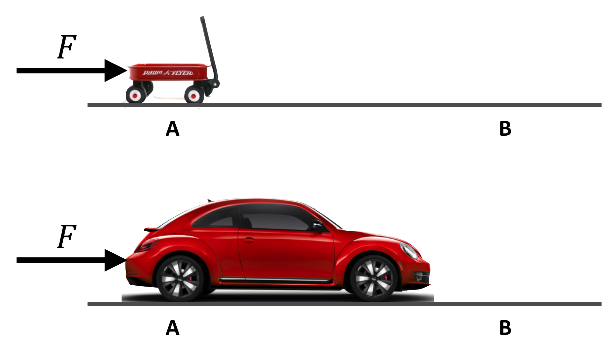
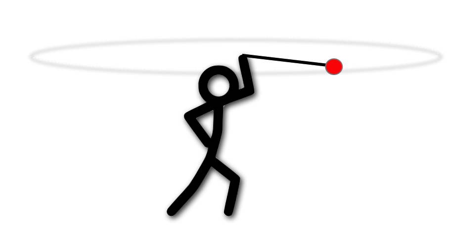
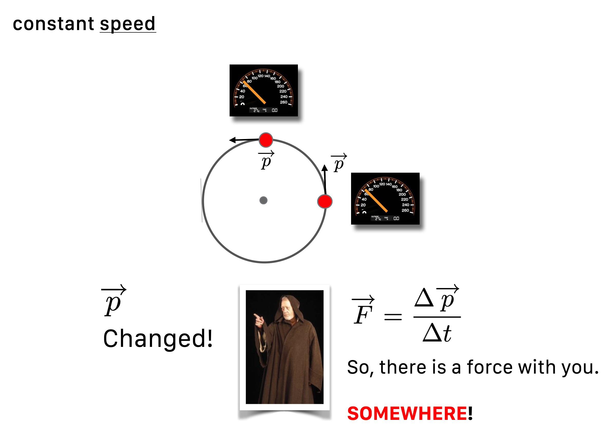
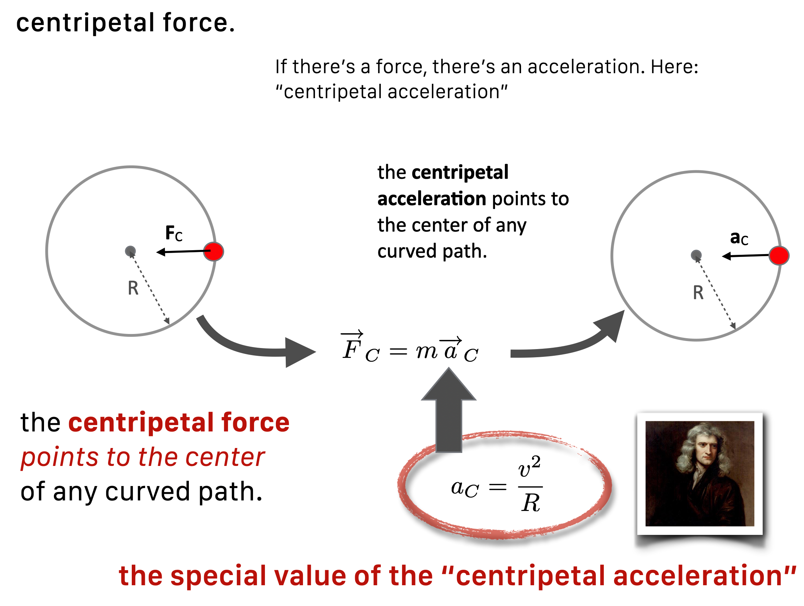

------------------------------------------------------------------------

Skinny Physics is meant to be a lightweight presentation of physics that might help you appreciate some of the posts in **QS&BB.**  This chapter shows some bare bones (skinny, after all!)  **facts about impulse, momentum, and force**.

There are three sections:

1.  Some ideas you might not have had in a previous course ("**Different way**") 😎. Better read this.

2.  Just a bare listing of some **momentum facts** 🎯.

3.  ...and, a bit of **gentle background** behind those facts woven around with worked-out examples 🐇.

    (If you'd like more, then visit a [full textbook](https://qstbb.pa.msu.edu/storage/ISP220_fall2020/QS&BB2020/intro.html) presentation.)

    

::: {.callout-important icon="false"}
🫵 You'll find that my needs for force and momentum are pretty one-dimensional. Not boring at parties, but our motions will often be only in one direction. So vector signs will not be often used and "direction" will be represented with just a sign. Also, if you've had physics before, you'll see no angular momentum here.
:::

## Just the facts 🎯:

Some definitions:

-   mass, $m$, is the quantity of matter...but this concept changes over history and is somewhat circular. It has a couple of jobs to do.
-   Job 1: **inertia** is the reluctance of an object to move and the measure of inertia is **mass**.
-   Job 2: **impulse** is related and sort of intuitive: push on something hard and it will go faster, push on something for a long time and it will go faster: $F\Delta t$ is proportional to the change in velocity and the proportionality constant is $m$

**A fact: impulse** $$
\begin{equation}
F\Delta t = m\Delta v \nonumber
\end{equation}
$$

**A fact: momentum** $$
p=mv \nonumber
$$ How it fits into impulse: $$
\begin{align}
F\Delta t &= \Delta (mv) \text{ and since }p = mv, \nonumber \\
F\Delta t &= \Delta p \nonumber \\
\end{align}
$$

**A fact: force**

from the above:

$$
\begin{align}
\text{rearranging impulse: }F &= \frac{\Delta p}{\Delta t} \nonumber \\
\text{if the mass is constant } F &= ma \nonumber
\end{align}
$$

## Anchors to topics ⚓️:

::: {.callout-tip icon="false"}
🔐 Bottom line sections with stuff to remember in this chapter:

-   impulse is in Section @sec-momentum

-   mass is in Section @sec-mechmass

-   momentum is in Section @sec-mechmomentum

-   Newton's second law of motion is in Section @sec-secondlaw

-   Circular motion is in Section @sec-circular
:::

## Gentle explanations of Momentum and Force 🐇
To start something moving from rest? Apply a force. 
Here's what he said in his "**First law of motion**":

::: {.callout-important icon="false"}
🫵 Whenever there's a change of velocity on any object, a force is at work: since acceleration is a change in velocity, forces are responsible for acceleration. Note: because velocity is technically a vector, then changing direction is also changing velocity.
:::

Let’s start slowly and sneak up on this idea. Impulsively.

### Impulse – Every sport {#sec-momentum}

In **QS&BB** we don't need much depth, but we do need three important concepts...the ones that underpinned Newton's system: **force**, **mass**, and **momentum**. Let's move:

> Newton: To get something up to speed, you need to push it or shove it --- either *a sharp collision or a steady push* increases the speed of an object. Push harder? More speed. Push longer? Again, more speed.

Let’s imagine a force, $F$ that pushes during some time interval, $\Delta t$. A whack means that $\Delta t$ is small (like a golf club hitting a ball) while a steady shove – a force –  (like a rugby scrum) means that $\Delta t$ is larger.

We have the beginnings of a model:

$$\begin{equation}
F\Delta t \propto \Delta v. \nonumber 
\end{equation}
$$ {#eq-impulse1}

Increase $F$, $\Delta t$, or both on the left-hand side, and the speed goes up on the right-hand side. The quantity on the left side is called the **Impulse**. It's the sports-quantity. Any game involving a ball or a human body under stress (probably not chess or poker) involves impulse and exceptional athletes can control both the $F$ and the $\Delta t$. The quantity on the right implies that the speed changed and of course if the speed changed, then the object accelerated and/or it changed direction.

We need to refine the model. But first some units and language:

> **May the force be with you by so many different names**
> We will use forces many times in **QS&BB**, which is a common quantity in our lives.  If you’re from the United States, when you step on the bathroom scale it reports back your weight in the [Imperial Measurement System](https://en.wikipedia.org/wiki/Imperial_and_US_customary_measurement_systems) (or “customary measures system”) as **Pounds**, lbs. In a minute, you’ll see why that’s confusing when comparing to the rest of the world where the bathroom scale would report **kilograms.** Weight is a force. Kilograms is not a force. 
>
> The unit of force in the [International System of Units (SI)](https://en.wikipedia.org/wiki/International_System_of_Units) , which includes the older “metric system” or MKS (Meter, Kilogram, Second) is the **Newton**, N. If you go to the gas station in Berlin, you’ll fill your tires to a pressure measured in Pascals, which is Newtons per square meter. Of course up the street from me, our Michigan gas station reports pounds per square inch for my pressure.

We'll predominantly use the unit of Newton as the modern measure of a force – like the rest of the civilized world. I'll not obsess with units and so I'm happy for you to rely on Mr. Google in almost all instances.

::: {.callout-note title="Example" icon="false"}
✏️  TEXT [**Unit conversions**](LINK.html)
(Under Construction 🚧 👷‍♂️  placeholder for an example 🔎 unit conversions)

:::

::: {.callout-tip icon="false"}
🔐 Type this into your browser: "convert 10 pounds into newtons" and you'll be rewarded with the answer and a tool for all kinds of unit conversions. You're welcome.
:::

## Inertia and Newton's Mass {#sec-mechmass}

*Pressing* forward (see what I did there?). Let's think about pushing.

Suppose I apply a force of $F=100$ pounds for 60 seconds to a Volkswagen and you apply a force of $F=100$ pounds for 60 seconds to a little red wagon. We both begin our efforts at point A:

{#fig-motion_head2 fig-align="center" width="80%"}

Will the resulting $\Delta v$ at point B be the same for both vehicles?

Of course not. The little red wagon will gain more speed than the Volkswagen (regardless of its color). The VW is more reluctant to be accelerated than the wagon. So @eq-impulse1} is not the whole story. What's missing is just that reluctance that any object has to being accelerated, which has a name: **inertia**. With that we can turn the proportionality in Equation \ref{impulse1} into an equation.

### Mass
Mass is a toughy and we'll see over and over how complicated it is – right to the current day. Here's how he defined it in the *Principia*:

> "Mass is the quantity of matter arising from its density and bulk conjointly."

There you go. Useful? ...no?

You do perfectly well to accept the idea that mass is the **quantitative measure of an object's reluctance to be coaxed into changing its motion.**

Here begins our love-hate relationship with mass. This much works:

::: {.callout-important icon="false"}
🫵 *Inertia* is an object's resistance to being accelerated and the *measure of an object’s inertia* is its *mass*.
:::

This is the most profound and at the same time, the most mundane idea that Newton had!

::: {.callout-tip icon="false"}
🔐 At the deep level of elementary particles, mass confuses us, perhaps in a different way from how it confuses engineering freshmen. We think that mass may actually not be an actual property of object, but rather a result of an object's interaction with a spooky field that sprang into existence just after the birth of the Universe. Now, in the 21st century, we've got a whole new set of neuroses about this subject, as understanding it occupies almost the entire Particle Physics community. So, Mass has been a problematic subject since its beginning in Newton's hands.
:::

## The "Quantity of Motion": Momentum {#sec-mechmomentum}

We just developed a sense that our hand-built, car-pushing formula, Equation @eq-impulse1 has to depend on speed *and* mass and so we'll just add it in on the right-hand side to get:

$$\begin{equation}
F\Delta t = m\Delta v \nonumber
\end{equation}
$$ {#eq-impulse2}

Being more explicit, when fleshed out impulse is

$$\begin{equation}
F\Delta t = m(v - v_0). \nonumber 
\end{equation}
$$ {#eq-fullimpulse}

> There’s more to this story.
> To be totally correct, the right hand side of Equation @eq-impulse2 can be written as $\Delta (mv)$ which recognizes that the mass might change instead of, or in addition to, the velocity changing. This is how a balloon jumps from your hand when you stop pinching the nozzle, or how a rocket is propelled by ejecting burned propellant out the back. In each case, the mass of the moving object changes and that results in a thrust. 

This quantity on the right, $mv$ is Newton's **definition of momentum.** $$
\begin{equation}
p = mv \nonumber
\end{equation}
$$ {#eq-momentum}

So the impulse can be rewritten with the definition in Equation @eq-fullimpulse:

$$\begin{align}
F\Delta t &= \Delta (mv) \nonumber \\
F\Delta t &= \Delta p \tag{a} \\
F\Delta t &= p_f-p_0 \tag{b} \\
\end{align}
$$ {#eq-momentumdef}

The athletic use of this is instinctive and learned...but with muscles and your neurosystem not paper and pencil:

{#fig-impulse_balls fig-align="center" width="80%"}

### Example: Impulse, sports, and a batted ball

::: {.callout-note title="Example" icon="false"}
A video example
🎥 TEXT
(Under Construction 🚧 👷‍♂️  placeholder for an example 🔎 XXXX)

:::

------------------------------------------------------------------------
### Example: That aircraft carrier again

::: {.callout-note title="Example" icon="false"}
✏️  Let's get a picture of momentum in action. Maybe the biggest moving thing that humans make: aircraft carriers. The Nimitz class aircraft carriers (10 of them) are among the largest naval vessels ever produced. (The new Gerald Ford class are more modern but about the same size.) Here are some details, approximates used for easy calculations.

-   Mass: 80 Million kg, $80 \times 10^6$ kg.
-   top speed: 32 knots or 37 mph or 16.5 m/s 

[**The momentum of an aircraft carrier**](./examples/_output/Nimitz_1_E2.html)
:::

So, repeat after me:

-   If there is no net force on an object

    -   its motion doesn’t change

        👉 if its speed was zero…it stays zero

        👉 if its speed was 55 mph…it stays at 55 mph

Said another way, if you see the motion of any object changing... then somewhere there is a force actiing (it might be invisible, like a magnetic field).

## Newton's second law of motion {#sec-secondlaw}

One quick change of @eq-momentumdef (a) 

$$\begin{align}
F\Delta t &= \Delta p \nonumber \\
F &= \frac{\Delta p}{\Delta t} \tag{a} \\
\text{since: }&=\Delta p = \Delta (mv) \nonumber \\
\text{if the mass is constant: } \nonumber \\
F &= \Delta p =m\Delta v \nonumber\\
F &= m \frac{\Delta v}{\Delta t} \nonumber \\
\text{and since: } &= \frac{\Delta v}{\Delta t} = a \nonumber \\
F &= ma \tag{b}
\end{align}
$$ {#eq-newtons2} 

A couple of these are suitable for a T-shirt: @eq-newtons2 (a) is formally "Newton's Second law of Motion" in its most general physics-major form. @eq-newtons2 (b) is the T-shirt version for motion in which the mass of an object undergoing a push doesn't change.

### Newton's three laws of motion {#sec-newtonslaws}

If there's a second law, there must be a first one and there is...and a third one. Here they are for completeness:

1.  An object with constant velociy will retain that constant velocity of zero or another value.
2.  Best expressed as an equation as @eq-newtons2 (a).
3.  For every force that object A applies to object B, an equal and opposite force will be appled by B to A.

The Third law is very useful for solving problems, but that's not what we're about in **QS&BB**.

### Weight {#sec-weight}

There's an important special case of Equation @eq-newtons2 (b) which has to do with the earth and, well, everything that's not nailed down. The earth attracts all objects with a force (which we'll talk about in a bit) that appears to be constant and has a particular value of acceleration, that of gravity., We affectionately call it $g$. So your weight is the force that the earth applies to you and so we simply have: 
$$\begin{align}
F &= ma \text{ ...now modify for gravitational force}\nonumber \\
F &= W \text{ for the special force called "weight"} \nonumber \\
a &= g \text{ for the special acceleration of gravity} \nonumber \\
W &=mg \text{ which is weight on earth} \tag{a}
\end{align}
$$ {#eq-weight} 
Two caveats:

1.  We call this $g$ "little g" and it's only got a specific value for the earth. There are different little g's for other planets, moons, or stars.
2.  The force of gravity is actually not constant – stay tuned. But miles above tthe earth it's still so close to $g$ that we often pretend that it's constant. (Stay tuned for the Gravitation chapter.)

So little g is an important number:

-   In the American system, $g = 32$ feet/second$^2$ , 32 ft/s$^2$
-   For the rest of the world, $g = 9.8$ meters/second$^2$, 9.8 m/s$^2$
-   (Notice the units for acceleration.)

## Circular Motion {#sec-circular}

Remember that if a velocity changes, then there's an force acting as a cause and an acceleration is the result. Well, what about driving around a curve keeping your speedometer at 50 mph? This is the one time in **QS&BB** we'll care about the vector nature of velocity. A true (for a professional physicist or student) velocity has a magnitude (what your speedometer reads back) and a direction. So going 50 mph north *is a different velocity* than going 50 mph east. Same [speed]{.underline}, different [velocity]{.underline}.

Okay, what's going on with you turning that corner where your direction changes but your speed doesn't. From the formal definition, the velocity must change 👉 so there must be a force acting 👉 so there is an acceleration.

It might be easier to think of twirling something overhead. Suppose you tie a ball to a thin rope and get it rotating above your head in a horizontal plane, like our little guy in the figure.

{#fig-LABEL fig-align="center" width="80%"}

You can feel a tug. That is, the ball seems to exert a force on your hand through the rope. But what's really going on is that the ball wants to go straight (Newton's first law) and you pull it back incrementally, bit by bit as it goes around. You're supplying that force necessary to defeat its straight line motion aspiration.

This force-towards-the-center is called "**centripetal force**."

> You've maybe heard of "centrifugal force" but that's different and sometimes called a "ficticious force" which seems sort of insulting. But when you're a passenger in a car that's going around a curve, you really feel a force that's away from the center of the curve...that's centifugal. But that's just your body trying to obey that first law and go straight, while you're in this car going, well, not straight. Where do you get the force that makes you follow the car? The door against your shoulder, the friction of the back of your lap on the seat, and hopefully your seatbelt. Absent those forces which pull you toward the center of the curve, you'd go flying.

The acceleration that you (or the ball) experience is *toward the center of the circle* (which we'll say has radius $R$, following the direction of the force, and has its own formula and name of "centripetal acceleration" ($a_c$):

$$
a_c=\frac{v^2}{R}
$$

{fig-align="center" width="80%"}

From Newton's second law, there's then a centripetal force. That tug you provide to the ball of mass $m$ is:

$$\begin{align}
F_c &= m a_c \nonumber \\
F_c &=m \frac{v^2}{R} \tag{a}
\end{align}
$$ {#eq-centripetalf}

{fig-align="center" width="80%"}