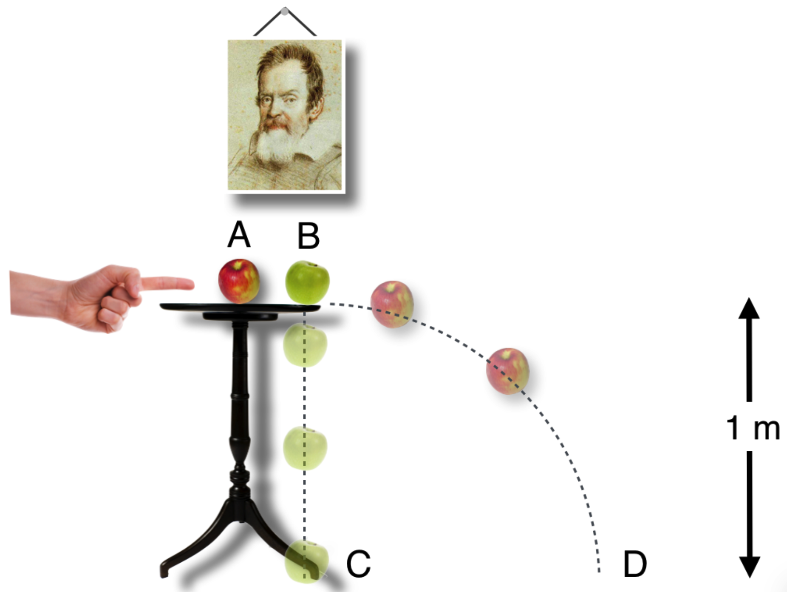

# Motion
## Example: an apple fall

**The Questions:** You'll see an apple example a lot. A beautiful, red Jonagold apple is struck from behind by an inexplicably disembodied left hand at point A. At point B it nudges a delightful Golden Delicious, green apple minding its own business while resting on the edge of the table to fall straight down. To further complicate this situation, there is no air in the room.

The red apple and the green apple start their descents at the same times. We will pretend that the acceleration due to gravity, $g=9.8$ m/s can be approximated to be $g=10$ m/s.

1.  How long does it take for the green apple to fall from point B to point C?
2.  How fast is the green apple going when it hits the floor at C?
3.  How long does it take for the red apple to hit the floor at D?

{#fig-LABEL fig-align="center" width="80%"}

------------------------------------------------------------------------

**The Answer:**

1.  The relationship between distance and time for constantly accelerated motion is Galileo's. And for our situation we have (taking $y$ to be down and positive): $$ \begin{align*}
    y&=1/2at^2 \\
    t &= \sqrt{2y/a} \\
    t &= \sqrt{2*1/10} = \sqrt{0.2} \\
    t &= 0.44 \text{ seconds}
    \end{align*}
    $$
2.  Here we don't need time, but a relation between speed and distance. Again, taking y to be down and the initial position to be from rest ($v_0=0$): $$\begin{align*}
    v^2 &= v_0^2 + 2gy \\
    v &= \sqrt{2*10*1} = \sqrt{20} \\
    v & = 4.5 \text{ meters/s} = 10 \text{ mph}
    \end{align*}
    $$
3.  The time is still 0.44 seconds – the apples land at the same time illustrating Galieo's discovery that the only acceleration is in the vertical direction and that the constant horizontal speed does not affect the fall.