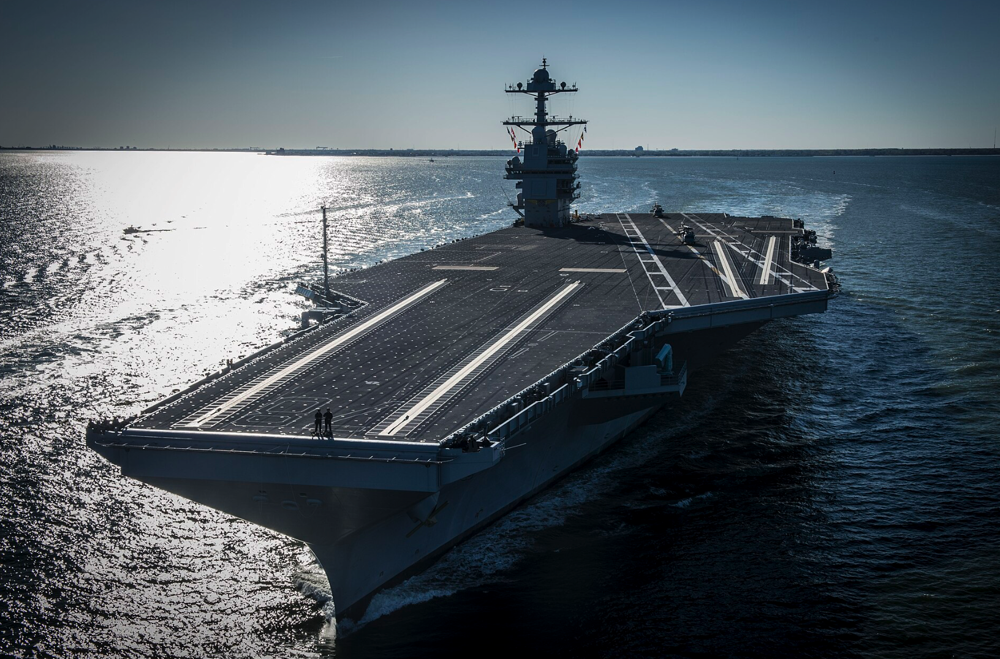

# Motion
## Example: USS Gerald R. Ford

**The Question:** The USS Gerald R. Ford class aircraft carrier is the lead supercarrier class in the US Navy. It carries about 4200 sailors and aviators and supports nearly 100 fixed wing aircraft. The Gerald R. Ford has a top speed that's classified, but it is at least 30 knots (34 mph). It displaces approximately 100,000 tons.

Suppose it was cruising at that speed in open water and came to a complete stop (an unusual maneuver) in 20 minutes, what would be its deceleration if it's constant?

------------------------------------------------------------------------

**The Answer:**

What do we know: $$
\begin{align}
v_0 &=30 \text{ knots} = 15.4 \text{ m/s}  \nonumber \\
v &= 0  \nonumber \\
t &=20 \text{ min}=1200 s  \nonumber
\end{align}
$$ So we need to find the acceleration --- which we expect to be negative because it's slowing down: $$
\begin{align}
v &= v_0+at \nonumber \\
a &= \frac{v-v_0}{t}  \nonumber \\
&= \frac{0-15.4}{1200} = -\frac{15.4}{1200} \nonumber \\
a &= -0.013 \text{ m/s}^2  \nonumber
\end{align}
$$

As a comparison, a large semi-truck with a mass of 36,000 kg traveling at 34 mph would experience a deceleration of about 16 m/s$^2$ and take about 5 seconds or so to stop. The folks on the aircraft carrier will hardly know they're stopping!