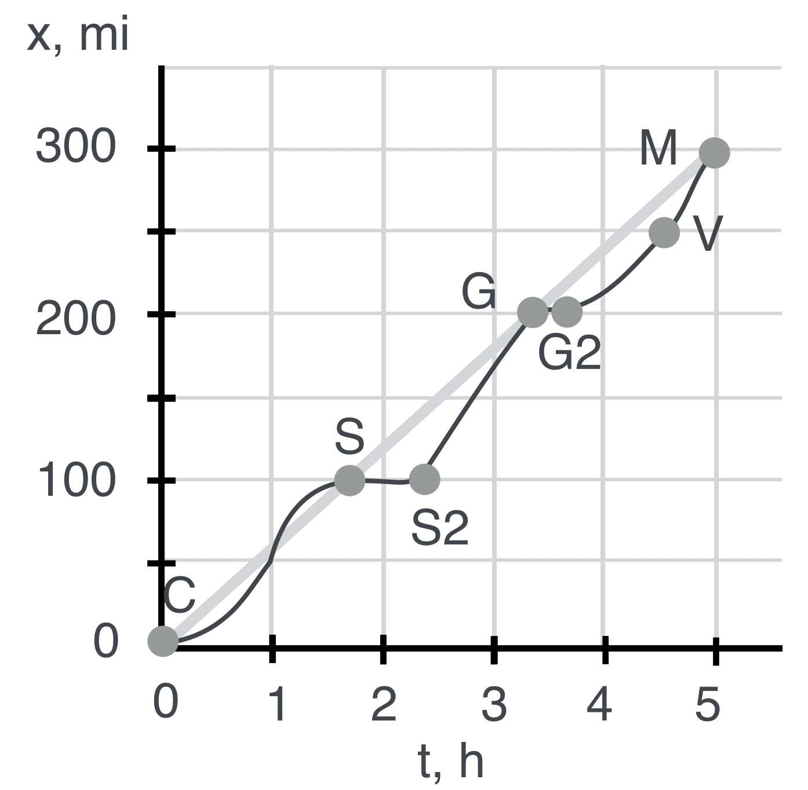

# Example: a realistic trip.

------------------------------------------------------------------------

## **The Question:** 

Notice what's going on here. We slowly gain speed after we start. We then slow down at S2 (Saginaw) and stop. We're getting gas. Then at S2 we very quickly hurry to Grayling. **What's our average speed between S2 and G?**

------------------------------------------------------------------------

## **The Answer:**

We could solve the equations using algebra or we can solve the equations using the graph. Let's do the latter. By looking at the space and time points we can roughly estimate:

$$
\begin{align}
v &= \frac{\Delta x}{\Delta t} \\
v &= \frac{200 - 100}{3.3 - 2.4}= \frac{100}{0.9}=111 \text{ (mph!)}
\end{align}
$$

That's moving right along. Notice that there's a little stop between G and G2? That's our conversation with a Michigan State Police person. Then we timidly go slower than the average until Vanderbilt (V)...and then the cop is gone and we skedaddle to the bridge at M.