------------------------------------------------------------------------

# Skinny Motion, Speed, and Acceleration

Skinny Physics is meant to be a lightweight (skinny, after all) presentation of physics that might help you appreciate some of the posts in **QS&BB.** Maybe you've had a course in your past or maybe not. This chapter shows some bare bones (skinny, after all!) **facts about motion, speed, and acceleration**.

So there are three sections:

1.  Some ideas you might not have had in a previous course ("**Different way**") 😎. Better read this.

2.  Just a bare listing of some **motion facts** 🎯.

3.  ...and, a bit of **gentle background** behind those facts 🐇.

    (If you'd like more, then visit the [full textbook](https://qstbb.pa.msu.edu/storage/ISP220_fall2020/QS&BB2020/intro.html) presentation.)

## Different way 😎:

::: {.callout-important icon="false"}
🫵 Even if you know some of the basics of velocity and acceleration, you need to be comfortable with **spacetime diagrams** in @sec-spacetimediagrams ! That's how we'll use Feynman Diagrams.
:::

::: {.callout-important icon="false"}
🫵 Two terms we use all the time: an "event" and an "interval." An *event* is a physical happening at a single point in space and time. An *interval* is the space and time difference between two events. @sec-spacetimediagrams !
:::

## Just the facts 🎯:

**Some definitions and my conventions:**

I'll use:

-   A subscript "0" for any quantity that is meant to be the beginning of a process or sequence of events:
-   $x_0$ to be where we start in distance
-   $x$ (no subscript) to be where we end up (sometimes, I'll be explicit and say "$x_f$" for "final.")
-   We’ll use the Greek symbol Delta, $\Delta$ to mean “change of”…this will come up a lot.
-   change in position is $\Delta x = x_{\text{ended up}}-x_{\text{where we started}} = x-x_0$
-   same goes for time, from $\Delta t= t_{\text{ended up}}-t_{\text{when we started}} = t - t_0$
-   the symbol for average: $\bar{A}$ or $\langle
    A\rangle$
-   the symbol for the (nearly) constant acceleration due to gravity close to the Earth's surface: $g$, aka "little gee"
-   Space and time are going to be our friends. If time doesn’t march on, we’ve not moved. But what is time? “Tubby…paused. ‘Time,’ he added slowly – ’time is what keeps everything from happening at once…”[^motion-1] We’ll see time take on a new meaning.

[^motion-1]: This is often attributed to Einstein, Woody Allen, and John Wheeler! It actually comes from Ray Cummings’ short story *The Time Professor* from 1921. Stick with me. You’ll learn all sorts of odd facts.

**A fact: average velocity**

The average speed that an object has after going a distance of $x_f$ after starting at position $x_0$ in a time $\Delta t$ is:
$$\begin{equation}
\bar{v} = \frac{x_f-x_0}{t_f - t_0} = \frac{\Delta x}{\Delta t} = \frac{x-x_0}{t - t_0} 
\end{equation}$$
so

**A fact: average distance traveled**
$$x =x_0 +\bar{v}\times(t-t_0)$$
often abstracted to:
$$x=vt$$
**A fact: acceleration**

In real life, acceleration is not necessarily constant, but we often pretend that it is in an elementary physics class:
$$\overline{a} = \frac{v-v_0}{t-t_0}$$

**A fact: Velocity for constant acceleration after given time**
$$v = v_0 +at$$
**A fact: Distance traveled for constant acceleration**

$$x = x_0 + v_0t + \dfrac{1}{2} at^2$$

**A fact: Velocity for constant acceleration after given distance**
$$v^2   = v_0^2 + 2ax$$
**A fact: Distance fallen under constant acceleration due to gravity**
Down ↓ presumed to be in the positive direction (same direction as the motion and the force of gravity) 
$$y = y_0 + v_0t + \dfrac{1}{2} gt^2$$

## Anchors to topics ⚓️:

::: {.callout-tip icon="false"}
🔐 Bottom line sections with stuff to remember in this chapter:

-   average speed @sec-averagespeed
-   **spacespace** and **spacetime** diagrams @sec-spacetimediagrams
-   the set of equations for 1-dimensional motion @sec-equationsofmotion
-   2 dimensional motion: projectiles @sec-projectiles
:::

## Gentle explanations of Velocity and Acceleration 🐇

### Getting From Here to There: At Constant Speed

::: {.callout-important icon="false"}
🫵 motion: it’s everywhere
:::

Whether it’s runners on a track, the cosmic rays constantly going through us from above, orbiting planets, electrons in a wire, electromagnetic waves, quark wavefunctions inside a proton, electrons and holes in a semiconductor, or the stretching of spacetime itself. Everything is about "motion." Motion is both the easiest and the hardest concept in physics and so much of what comes for us will constantly stretch at ideas about what motion is and how we can describe it. So we need to start at the beginning. Because:

> Almost everything in physics boils down to: motion. (Even boiling.)

But at its most basic, our physics will be all about how to get from *here* to *there* and from *then* to *now*, and to be able to explain how that happened and predict what will come next.

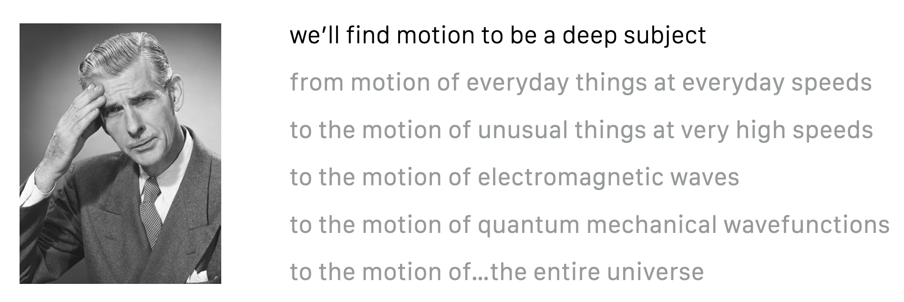{fig-align="center" width="80%"}

Characterizing motion is simple in principle! You need two things:

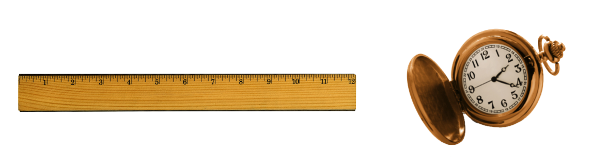{#fig-ruler fig-align="center" width="80%"}

And for everyday motion, that seems reasonable–and you already know a lot about that.

Suppose you're on a trip and you timed yourself between the two mile markers: 50 miles and then 350 miles in 5 hours.

What was your speed? I know you know this: your brain would quickly calculate:

-   I went 350 – 50 = 300 miles
-   it took me 5 hours
-   so my speed was 300/5 = 60 "miles per hour," mph

So:
$$v=60 \text{ mph}$$

That's an average and doesn't care what happened in between the first second and the last one.

More realistically, you speed up, slow down, stop, keep going...So what if we stop for an hour and then start up after that long break? How do we refer to the speed then? Same way.

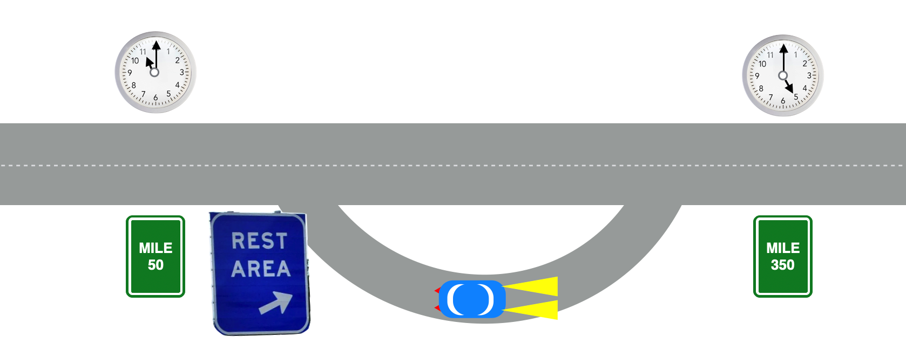{#fig-rest fig-align="center" width="80%"}

### Average speed {#sec-averagespeed}

In part of the trip we'd be moving and in part of it we'd be stationary. But notice that the time is now 6 hours while the distance is still 300 miles. Now your brain would be doing an average speed calculation with a different beginning and ending times and distances. You'd now say that:

$$\overline{v}= 50 \text{ mph}$$

Remember, the overline notation means "average" or "mean"...the average speed only depends on the beginning and ending points. Average speeds are not that unfamiliar, but that's because you don't probably think of it that way. But you've all asked yourselves the question, "I've got to go 100 miles and I think I can travel at 70 mph, so I'll be home in about one and a half hours." Your speedometer reports averages also, but in time slices that are very, very small.

So you've known for a long time that:

$$\text{speed} = \dfrac{\text{distance traveled}}{\text{time taken}}
$$ {#eq-speedwords}

is the rate at which distance changes with time.

### Speed in Modern Terms

Let’s make this more compact by inserting customary symbols to get rid of the English words. Here are some grammar rules in QS&BB:

-   We’ll limit ourselves almost exclusively to motion in one dimension in space.
-   We’ll use the symbol $v$ for speed (because customarily, we’ll speak of “velocity”…more about this below).

With this, then we can "solve" this simple problem:

$$\begin{align}
v &= \text{speed}=\dfrac{\text{distance traveled}}{\text{time taken}} \text{ in symbols as} \nonumber \\
v &=\dfrac{x-x_0}{t-t_0} \nonumber \\
&= \dfrac{350-50}{6}=50  \text{ mph} \nonumber
\end{align}
$$ {#eq-speeddef}

where "$v$" is the velocity and it's defined by the middle equation in equation @eq-speeddef.

## Gravity

Famously, Galileo Galilei determined that any object near the earth would fall at a constant acceleration. How he determined this was clever and you can read the story at [Galileo](https://qsbb2020jupyter.netlify.app/motion/j-050_motion_g_galileo2_s7). What he found was that the speed of a falling object would increase linearly with the time of it's fall. A competing idea from other natural philosophers including Leonardo DaVinci, proposed that the speed would increase linearly *with distance, not time*.

What Galileo knew from medieval considerations was that this linearity with time for $v$ meant that distance had to increase quadratically with time.

So, a modern model of Galileo's qualitative conclusion is:
$$\begin{align}
v(t) &\propto t \nonumber \\
x(t) &\propto t^2 \nonumber
\end{align}
$$
The symbol $\propto$ means "proportional to" and when we find a relationship like that, we can usually turn it into an equation by inserting some constant of proportionality. For falling bodies near the earth, the symbol for that constant is called "$g$" or "little g." Now we can fully-form the model as:
$$\begin{align}
v(t) &= gt \nonumber \\
x(t) &= 1/2gt^2 \nonumber
\end{align}
$$
There are simplicity reasons for the 1/2...if we'd absorbed that into $g$ then the first equation would have had to change. The value of $g$ comes from experiment and is about

$$
\begin{equation}
g = 9.8 \text{ m/s$^2$} = 32 \text{ ft/s$^2$}. 
\end{equation}
$$

While this is a story that started with gravity, it's nonetheless a completely general description of any accelerated motion (your car) if that acceleration is constant. In general, then, we'd use the symbol $a$ and treat falling as a special case of constantly accelerated motion in which case $a=g$.

While we defined speed in terms of distance, we can rewrite @eq-eq1. $$
\begin{align}
\text{For constant speed,}&\text{ no acceleration} \\
v &=\dfrac{x-x_0}{t-t_0} \nonumber \\
x-x_0 &=v(t-t_0) \nonumber \text{ let's take our initial time be 0} \\
x &= x_0 + vt
\end{align}
$$

And for constant acceleration, we can find a general relationship for distance as well with a simple calculation. We have now equations for motion that involve $x,v, a$ and $v, a, t$. A complete set would involve only $v,a,x$ and here's a video where I derive all of them for you in two ways: without calculus and followed by a quick repeat using calculus. Neither will hurt.

::: {.callout-warning icon="false"}
⚠️ A bit of algebra is required to derive the complete quartet of equations for motion with a constant acceleration. I do that for you in [equations of motion](./Motion_equations.qmd)
:::

::: {.callout-note icon="false"}

📺  Or, you can watch a video of my deriving the equations of kinematics
:::

::: {style="padding:56.25% 0 0 0;position:relative;"}
<iframe src="https://player.vimeo.com/video/1190824142?badge=0&amp;autopause=0&amp;player_id=0&amp;app_id=58479" frameborder="0" allow="autoplay; fullscreen; picture-in-picture; clipboard-write; encrypted-media; web-share" referrerpolicy="strict-origin-when-cross-origin" style="position:absolute;top:0;left:0;width:100%;height:100%;" title="kinematics equations">

</iframe>
:::

::: {.callout-note icon="false"}

📺  And in a few lines, I can do that using a tiny bit of calculus
:::

<iframe src="https://player.vimeo.com/video/1190826533?badge=0&amp;autopause=0&amp;player_id=0&amp;app_id=58479" frameborder="0" allow="autoplay; fullscreen; picture-in-picture; clipboard-write; encrypted-media; web-share" referrerpolicy="strict-origin-when-cross-origin" style="position:absolute;top:0;left:0;width:100%;height:100%;" title="kinematics_calc"></iframe>

{fig-align="center" width="80%"}

## Complete model for motion {#sec-equationsofmotion}

So collectively, here are our definitions for motion:

$$\begin{align}
\text{Constant speed,}&\text{ no acceleration} \nonumber \\
x &= x_0 + vt \nonumber \\
v &= \text{ constant} \nonumber \\
a &= 0 \nonumber \\
\text{Constant}&\text{ acceleration}& \nonumber \\
a &=\dfrac{v-v_0}{t-t_0} \nonumber \\
a &= \dfrac{\Delta v}{\Delta t} \nonumber \\
\end{align}$$

And here are the complete set of equations for one-dimentional constant acceleration. Each relation relates two of the three variables: $x, t, v$.

$$\begin{align}
& \text{1. } \; x = \langle v \rangle t \tag{a}  \\ 
& \text{2.  } \; v   = v_0 + at \tag{b}  \\
& \text{3. }  \; x   = x_0+v_0 t + \frac{1}{2} at^2 \tag{c} \\
& \text{4. }\; v^2   = v_0^2 + 2ax \tag{d}  
\end{align}$$ {#eq-collective}

(Under Construction 🚧 👷‍♂️ placeholder for an example 🔎 apple drop time and speed)

[Apples falling](./examples/_output/apple_motion.html)

(Under Construction 🚧 👷‍♂️ placeholder for an example 🔎 Pisa)

Notice two things. If the motion is at a constant velocity, then setting $a=0$ recovers that special case. And notice that @eq-collective (d) does not have time as a variable and that will turn out to be interesting when we talk about energy.

### Maybe some examples?

::: {.callout-note icon="false"}
 ✏️ A written example

Let’s go “up north” (which in Michigan is a thing), but we’ll do it at a constant speed: 
[**up_north.html**](./examples/_output/up_north.html)
:::

::: {.callout-note icon="false"}
 ✏️ A written example

But that doesn’t make sense. How about a more sensible trip with starts and stops...and state police?
[**up_north_realistic.html**](./examples/_output/up_north_realistic.html)
:::

Finally, let's take a plane ride. My favorite airplane is the Airbus 330-300, seat 41A, which is my transportation from Detroit to Amsterdam over and over and over and over ...again.....in order to get to CERN.

Watch this video to ask and answer a simple question: how fast is it going on a typical take-off? The runway is 9000 feet long and I measured 50 seconds from standing still to "rotate"...take-off.

::: {.callout-note icon="false"}
 A video example
📺  Airbus 330-300 speed at takeoff. Listen in the cockpit for "V1" at about 45 seconds and "rotate" at about 47 seconds. Wheels up seems to me to be at about 51 seconds. Now let's play with these numbers.
{fig-align="center" width="80%"}
:::

::: {.callout-note icon="false"}
 A written example
✏️  Let's stop an aircraft carrier. The BIGGEST aircraft carrier: [**USS Gerald R. Ford**](./examples/_output/ford_1.html)
:::

## Dimensional Analysis

This might be superfluous for most of your interests, but sometimes it's usefult to keep track of the dimensions of quantities. It can check an answer after a calculation – if the dimension of a result should be mph but it comes out to be "pounds" then you made a mistake somewhere. But it's also useful to keep track of changing from one set of units to another, like miles per hour to meters per second.

The usual way of keeping track of the dimensions is a different kind of bracket: $[A]$ would refer to the "dimension of $A$". For $A=50$ mph, $[A]=$ mph. Get it?

So if our distance units were feet and our time units were hours, then we would say that the dimensions of velocity could be determined to be:

$$\dfrac{[\text{distance}]}{[\text{time}]}=\dfrac{\text{feet}}{\text{hours}} = [v] = \text{feet per hour}$$

So the dimensions of velocity are familiar:

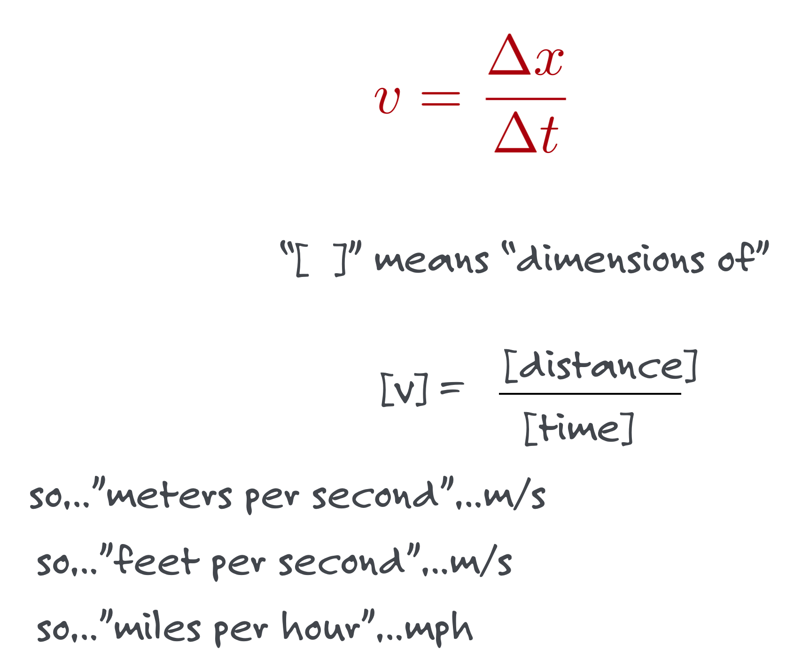{fig-align="center" width="60%"}

Dimensions of acceleration are a little unfamiliar but we can work them out:

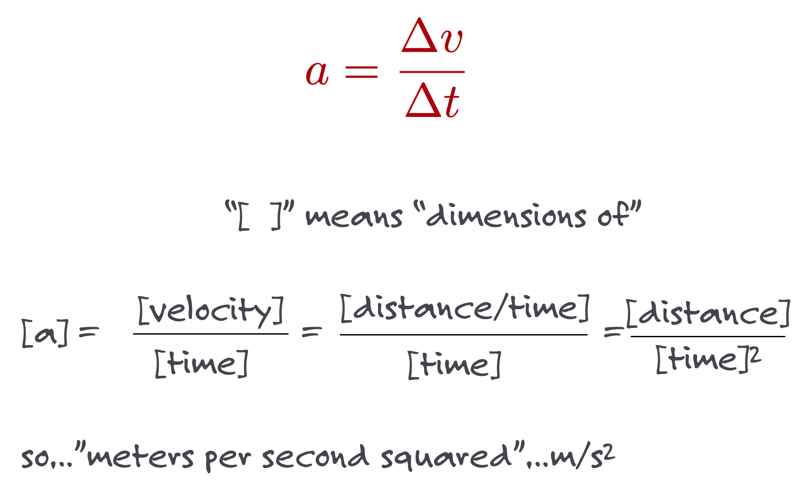{fig-align="center" width="60%"}

Of course the simplest acceleration is a constant one...that during any time interval, the speed increases and the rate at which the speed increases is constant.

## Spacespace and Spacetime Diagrams {#sec-spacetimediagrams}

There are multiple ways to represent motion... an equation like @eq-speeddef is a model. But graphical representation is also very useful. Here are two, "**spacespace**" (my label) diagrams and "**spacetime**" (standard physics label) diagrams:

### spacespace diagram: stationary object

Let's imagine a pool table. Here it is with a set of $x-y$ axes. Notice that I've placed a ball at a point with initial coordinates (*x*~0~, *y*~0~):

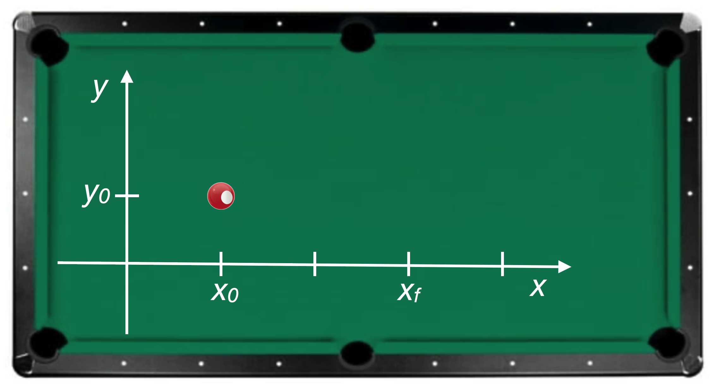{#fig-balltablestill fig-align="center" width="80%"}

Now don't touch it and patiently wait a few minutes ...here it still is:

{fig-align="center" width="80%"}

Let's plot it on an x-y axis set, keeping time while it sits there.

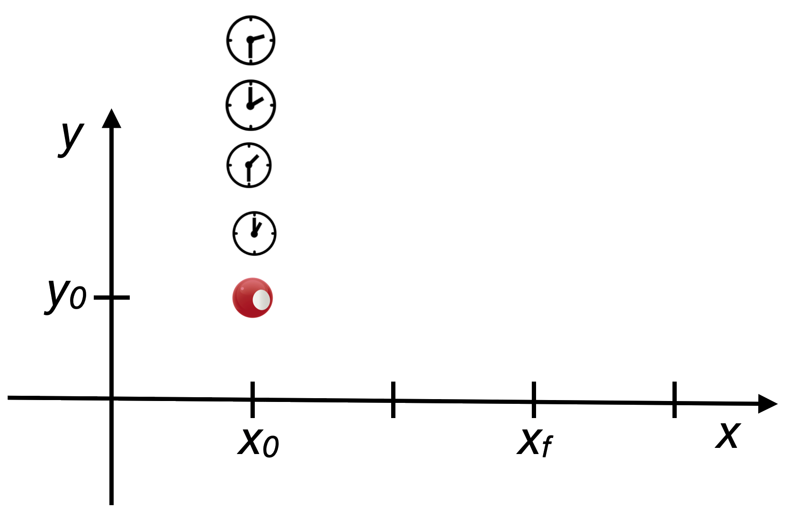{#fig-fig-ballstillss fig-align="center" width="68%"}

I call this diagram a **spacespace diagram** since both axes are space coordinates. It's how you think about things normally. As time progresses, our ball doesn't move on the table, so the $x$ and $y$ coordinates of the ball at any time are the same.

### spacetime diagram: stationary object

Now supposed I plot the ball's trajectory (yes, "trajectory") as a function of space and time. I'll put time on the horizontal axis and I'll have to choose a space coordinate (to be a picture in two dimensions) and I'll choose $x$.

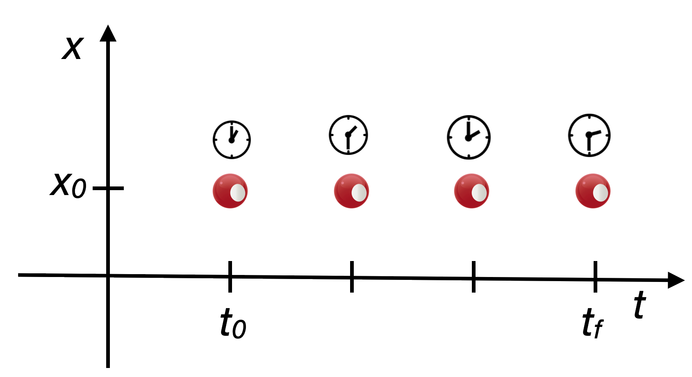{#fig-ballstillst fig-align="center" width="68%"}

Now you see "movement"...the stationary ball is moving in *time* but not in *space*. This is an example of a **spacetime diagram**. Not very interesting.

### spacespace diagram: moving object

Just sitting still isn't interesting, so let's roll the ball across the pool table:

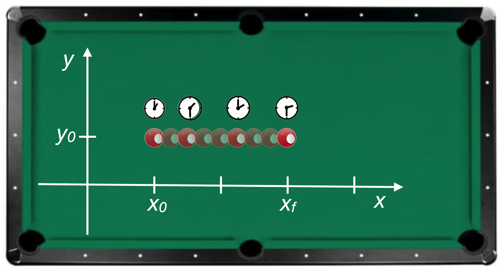{#fig-ballconstantss fig-align="center" width="68%"}

You can see the ball changing its $x$ position as the clock advances:

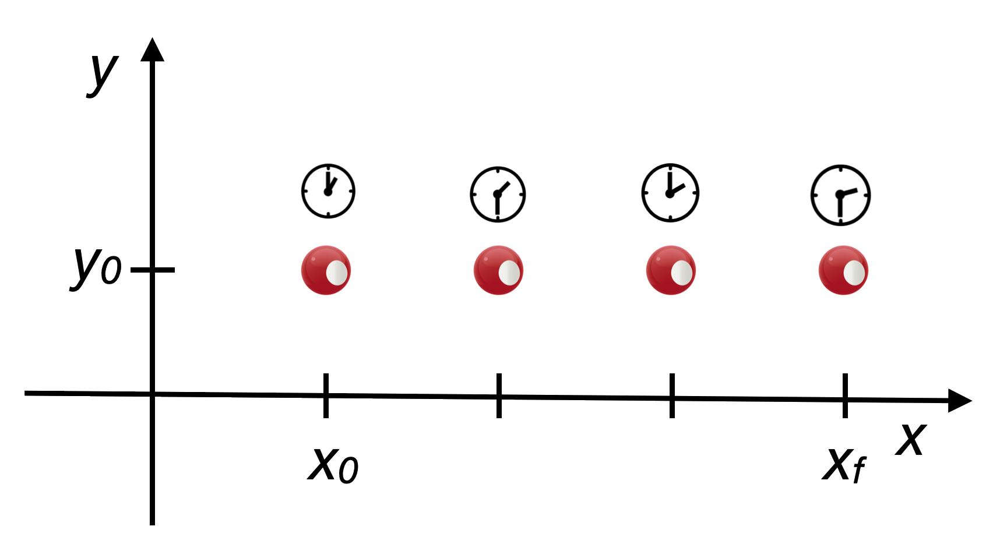{#fig-spsp_move fig-align="center" width="68%"}

While the ball moves in space, it's also moving in time but the time coordinate is still implied or hidden. The clocks show what it might be if one were to use a stopwatch to monitor its motion for 4 points along the trajectory.

Since the ball moves only horizontally, $y_0$ doesn't change and so I can still represent all of the motion in a space ($x$) and time ($t$) way and here is the spacetime diagram for this simple situation

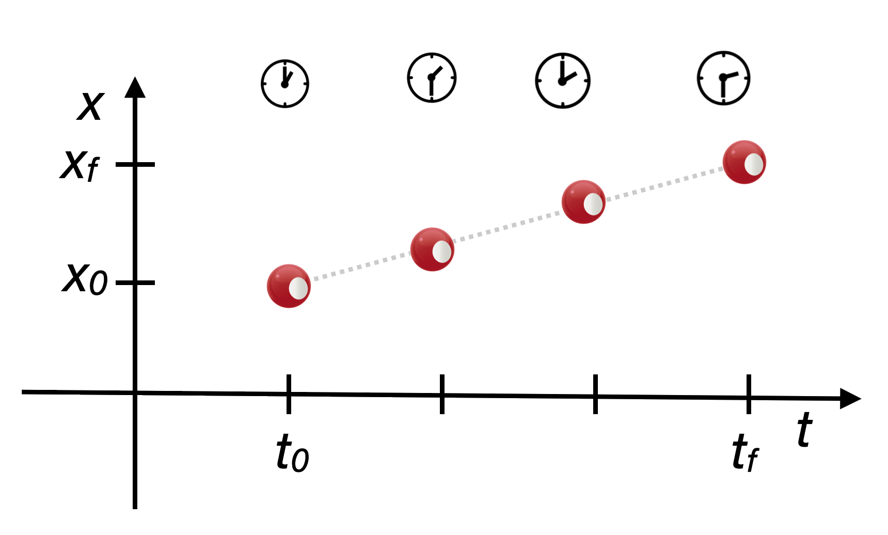{#fig-ballconstantst fig-align="center" width="68%"}

Notice that the trajectory in spacetime is a straight line and its slope? The velocity, which is a continuous curve in this diagram, and the dashed line shows it.

## Graphing motion

This is a model of motion, which for physicists is always a curve in some coordinate system. Here the slope is

$$\begin{align}
v &=\dfrac{x-x_0}{t-t_0} \nonumber \\
v &= \dfrac{\Delta x}{\Delta t} \nonumber
\end{align}
$$

We can easily imagine that the motion might not be smooth (like the stopping and starting on the road above) and so the concept of the average is always in play:

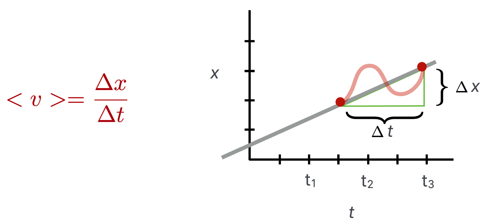{#fig-beginend fig-align="center" width="68%"}

The more precisely we sample the motion, the more precisely we converge on an **instantaneous speed**, which you're familiar with while driving with a speedometer in front of you. You think it's telling you exaclty what your speed is, but it is actually digitally sampling the rotation of your tires, but very finely.

In physics:

-   "kinematics" is the subject of motion
-   "dynamics" is the subject of forces...which cause the motion

Galileo introduced the idea of kinematics...he characterized motion without regard to what made the motion happen. Isaac Newton did the first legitimate analysis – model – of dynamics. He explained how to characterize forces and the motions that result. That's the subject of the next chapter.

### Graphing accelerated motion

The rolling ball's motion in spacetime had the same slope between any two time intervals – a straight line. So the velocity never changes.

But of course for motion to get started one has begin from rest and get going, so the velocity has to increase in time. That's what acceleration is.

-   Velocity is the rate at which distance changes in time.
-   Acceleration is the rate at which velocity changes in time.

Here are the two models of motion:

$$\begin{align}
v &=\dfrac{x-x_0}{t-t_0} \text{  model of velocity} \tag{a} \nonumber \\
v &= \dfrac{\Delta x}{\Delta t} \text{ and } \nonumber \\
a &=\dfrac{v-v_0}{t-t_0}  \text{  model of acceleration} \nonumber \\
a &= \dfrac{\Delta v}{\Delta t} \tag{b} \nonumber
\end{align}
$$ {#eq-eq1}

So if the speed is uniform, like the ball above, then the acceleration is zero (since $\Delta v = 0$).

If the speed changes in time, then we have accelerated motion since $\Delta v \ne 0$.

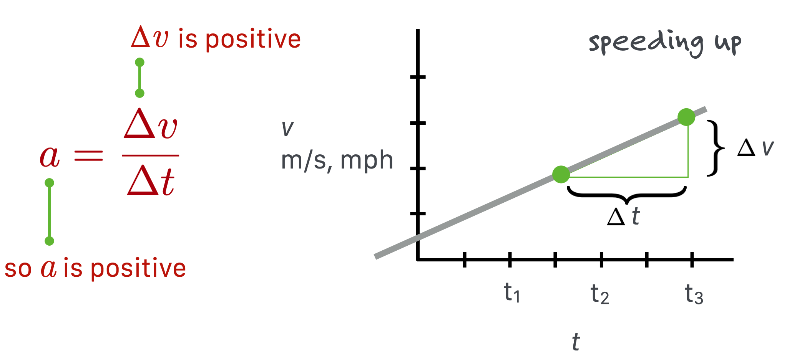{fig-align="center" width="80%"}

But sometimes you put on the brakes, and you know that you slow down because you can feel it and the speedometer is telling you that. So in increasing time intervals, the rate at which the speed changes is negative.

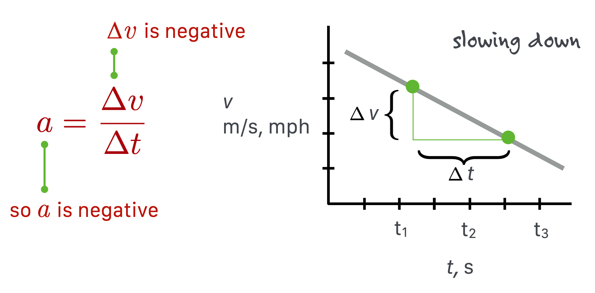{fig-align="center" width="80%"}

In the diagram, $\Delta v < 0$. This is a negative acceleration and is called [deceleration]{.underline}.

I've concentrated on acceleration and deceleration which are constant...the speed changes at a uniform rate, up or down. But that's not the only kind. Think about a sprinter. Just after the starting gun, a runner's speed out of the blocks is high and remains high for the first few steps. As the runner starts to become a little more vertical, air resistance becomes a factor and while the runner goes faster, she does so at a lower rate of speed increase. That's a non-constant acceleration.

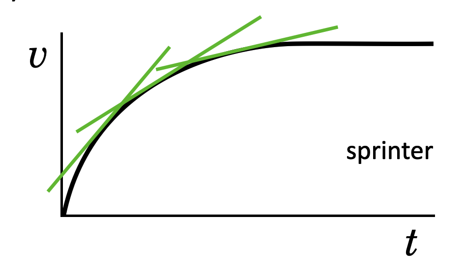{fig-align="center" width="80%"}

Now you can design a sports video game. All you have to do is measure an athlete's personal acceleration parameters and code them. I found this years ago for Madden NFL11 of a particular running back:

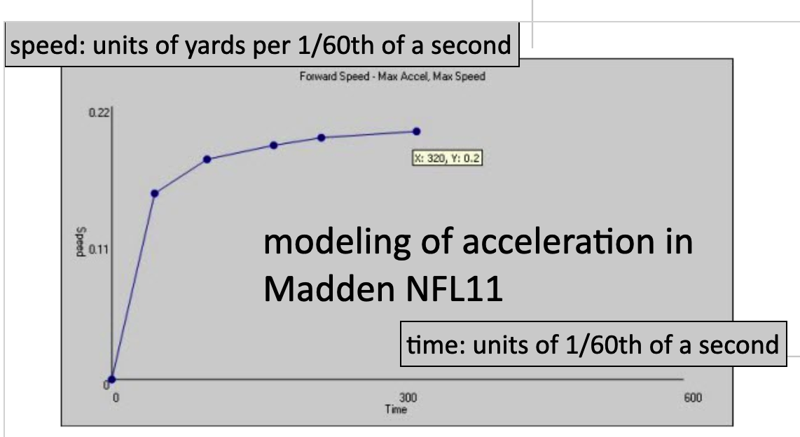{#fig-Madden fig-align="center" width="80%"}

------------------------------------------------------------------------

## Projectiles {#sec-projectiles}

When you throw a ball from centerfield to home plate, the ball executes what looks like a parabollic trajectory. The ball goes forward while it probably rises for a while and then drops toward the ground. That's two-dimensional motion and Galileo had the insipiration to figure out what was going on and how to do experiments to confirm his hypothesis that the up-and-down would follow the shape of a parabola.

His insight was that when motion is imparted to an object and the source of the motion is taken away (you throw the ball and it leaves your hand and is then in its own), that something stays with the ball. He called it "impeto" and we call it "momentum." The ball acquires momentum.

And he realized that whatever impeto the ball acquires in the horizontal direction is preserved, but the moment the ball leaves your hand, it starts to head toward the Earth. In modern words, we'd say that once released, the ball has a horizontal momentum that stays constant and a vertical momentum that changes and points down. The two motions are in some sense overlaid or shared by the ball.

{#fig-fig-motion_head2 fig-align="center" width="80%"}

In the figure you can see that the original velocity $v_1$ points up and foward and I've broken up this arrow (a vector) into it's horizontal component which you can see at 1, 2, 3, 4, and 5 is the same length. It's "impeto" is constant. The vertical component changes at each point – disappearing at the top – and then increasing down as the ball heads to Earth. Gravity wins.

For QS&BB we'll not need two dimensional kinematics.