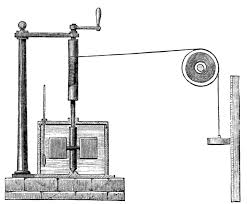
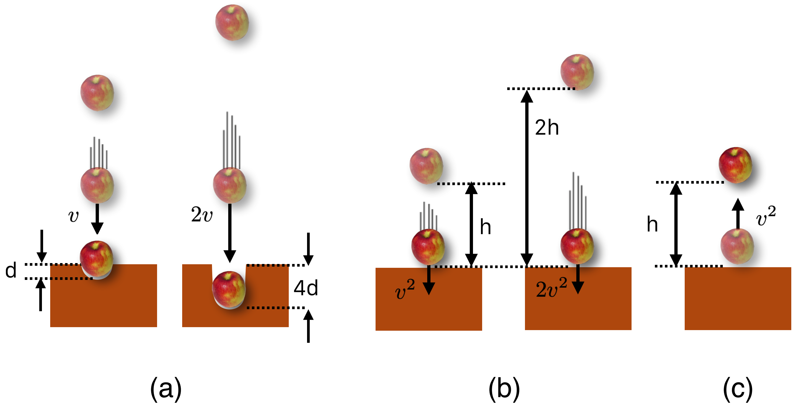
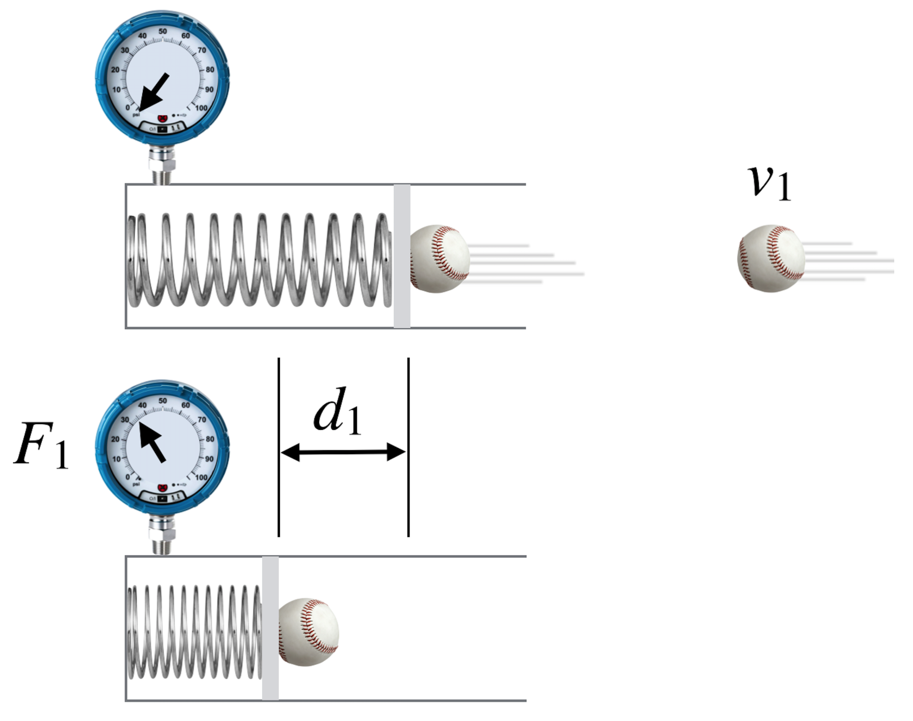
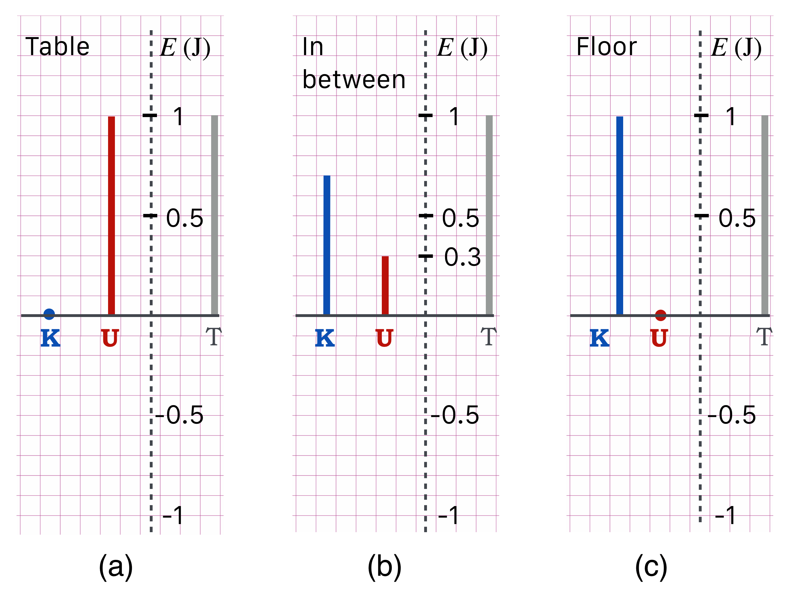
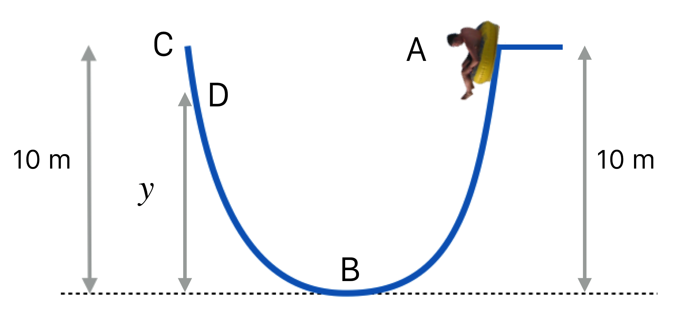
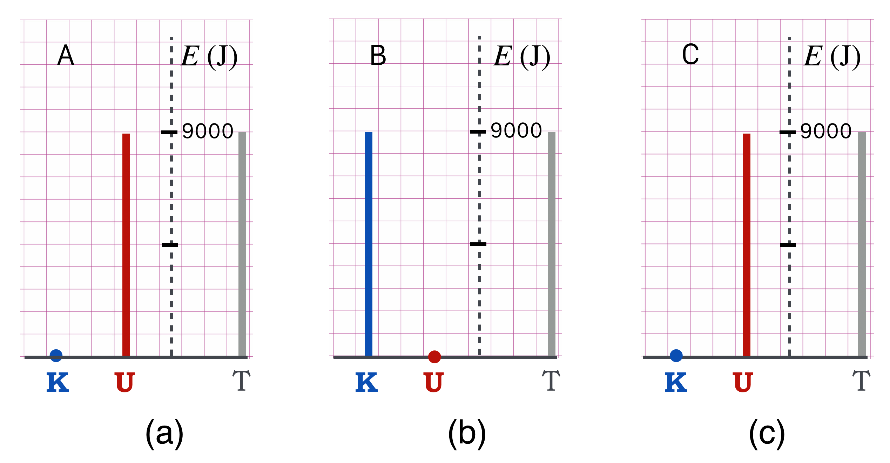

------------------------------------------------------------------------

# Skinny Energy {#sec-energy}

Skinny Physics: the Energy Edition. First, just the formulas then, some minimal narrative. (If you'd like more, including history and examples, visit [full textbook](https://qstbb.pa.msu.edu/storage/ISP220_fall2020/QS&BB2020/intro.html).)

## Different way

::: {.callout-important icon="false"}
🫵 Even if you have struggled with kinetic and potential energies, and especially conservation, you might find my thermometer diagrams useful.
:::

## Just the facts:

### some definitions

**kinetic energy, K**

$$\begin{equation}
K = \dfrac{1}{2}m v^2 \nonumber
\end{equation}
$$

**work, W**

$$\begin{equation}
\text{work}=W=F\Delta x=\Delta(\dfrac{1}{2}mv^2).
\end{equation}$$

**potential energy, U**

$$\begin{equation}
\text{work}=W=F\Delta x=\Delta(\dfrac{1}{2}mv^2).
\end{equation}$$

​​​**Energy Conservation, T**

$K_0, K$: initial, final kinetic energy

$U_0, U$: initial, final potential energy

$T$: the total energy

$$ 
\begin{align*} 
K_0 + U_0 &= K + U = T \\ 
\dfrac{1}{2}m v_0^2 + mgh_0 &= \dfrac{1}{2}m v^2 + mgh = T 
\end{align*} 
$$

## Pointers to topics:

::: {.callout-tip icon="false"}
🔐 Bottom line sections with stuff to remember in this chapter:

-   impulse is in Section @sec-momentum

-   mass is in Section @sec-mechmass

-   momentum is in Section @sec-mechmomentum

-   Newton's second law of motion is in Section @sec-secondlaw

-   Circular motion is in Section @sec-circular
:::

# Gentle explanations of Energy

## The Mechanical Equivalent of Heat {#sec-energy-joule}

In the 1840s, the Manchester brewer, James Prescott Joule conducted experiments that revolutionized our understanding of energy. In a family of brewers, he had access to precision thermometers (essential for brewing) and applied his systematic experimental approach to studying heat.

<aside class="marginfigure">

```{r}
#| label: fig-brewery
#| fig-cap: "Still making beer."
#| out-width: "50%"
#| echo: false

```

</aside>

Joule's key experiment involved stirring water with paddles turned by falling weights. He found that a specific amount of mechanical motion would raise the temperature of water by a predictable amount. His insight: **Heat and motion are both forms of energy which can be converted back and forth—and not disappear.**

```{r}
#| label: fig-joulemechanical
#| fig-cap: "Joule's device to demonstrate that stirring water would heat water. The weight on the right turns paddles in the beaker."
#| out-width: "68%"
#| echo: false

```

We remember him for this demonstration:

$$\begin{align*}
\text{mechanical motion } \to &\text{ heat} \\
\text{ and heat } \to &\text{ mechanical motion:} \\
&\text{ his early notion of energy conservation} \\
\text{gravitational height differences } \to &\text{ heat} \\
\text{electrical resistance } \to &\text{ heat} \\
\end{align*}$$

He realized that this led to a principle: **Energy is conserved**. What you put into a system by mechanical means, you'll get back in heat and vice versa. Nothing's lost. Nothing's spontaneously created.

::: {.callout-important icon="false"}
🫵 "Nothing can be lost in the operations of nature – no energy can be destroyed." — Lord Kelvin, 1847
:::

The unit of energy, the Joule (J), was named in his honor in 1889: - 1 Joule = 1 kg·m²/s² - It takes 4.184 J to raise 1 cm³ of water by 1°C

------------------------------------------------------------------------

## Ability to Do Damage: Kinetic Energy {#sec-energy-kinetic}

Okay. "Ability to Do Damage" isn’t a scientific phrase...but I’ll bet you’ll remember it better than our very specific use of a very regular word: "work." If you want to do damage to something, you initiate contact and *speed matters*. Want to demolish something with a hammer? Swing it fast. Want to smash something by dropping a rock? Drop it from high up.

But mass figures in too. A hammer made out of balloons is not a damage-maker. So the question is: **what's more important, mass or speed?**

### The Baseball Example

Let’s go back to high school.

> **Wait.** No! No no no no! <br> **Calm down.** It's just a cheap story device.

Principal Crotchety took away the catchers mitts from the boys baseball and girls softball teams, so each catcher must catch a pitched ball with his or her bare hands.

A regulation softball has a mass of about 0.22 kg while a regulation baseball has a mass of just about half of that, 0.145 kg. Here’s the question: An average high school softball pitch is about 50 mph – 10 or 15 mph faster than that, and you’ve got a college pitcher on your hands. But a 50 mph baseball is not so impressive: that's less than batting practice speeds. Consider these two trade-offs, and think about having to bare-hand catch the following:

-   Replace a baseball thrown of 50 mph with a softball of the same speed – a factor of 2 increase in mass, but same speed?

-   Replace a baseball thrown at 50 mph with a baseball thrown at 100 mph – a factor of 2 increase in speed but the same mass?

Which pitch would do proportionally more "damage"---hurt more? I’d take the first example any day.

Galileo observed pile drivers and found that doubling the drop height produces **four times** the penetration depth. This suggested that damage is related to the **square of velocity**.

```{r}
#| label: fig-known
#| fig-cap: "Relationships among height, speed, and penetration depth from Galileo's observations."
#| out-width: "100%"
#| echo: false

```

Catching a baseball is an $A+B \to C$ type of collision. Separate catcher, Herman plus the ball $\to$ sincle object, Herman/ball. From your experience, you know that if someone throws you a ball and you catch it, that you're (Herman/ball) probably not going to be carried backwards at a high speed.

(Under Construction 🚧 👷‍♂️ $\to$ placeholder for an example 🔎 deeper_catcher)

### Kinetic Energy In Practice {#sec-energy-energypractice}

Christiaan Huygens and Gottfried Leibniz independently concluded that in certain collisions, mv² is conserved. Today we call it

$$\begin{equation}
\text{Kinetic Energy: } K = \frac{1}{2}mv^2
\end{equation}$$

::: {.callout-important icon="false"}
🫵 **Kinetic Energy is the energy an object has because it's moving.**
:::

### Example

For a 50 mph (22 m/s) baseball: $$K_0 = \frac{1}{2}(0.145 \text{ kg})(22 \text{ m/s})^2 = 35.1 \text{ J}$$

When caught by a 54 kg catcher, the combined kinetic energy after is only about 0.1 J.

> **Wait.** This surprises me. Where did all that speed go?<br> **Glad you asked.** In this (perfectly constructed) example, there's only an imperceptible speed after that fast ball hits its target (Herman). Stay with me, and we'll find where the speed went!

------------------------------------------------------------------------

## Classification of Collisions {#sec-energy-classification}

If you think about colliding objects, they can be categorized into three different kinds.

## Collisions in words

We can do this by "makes sense" or with equations. Let me do the former in reverse order from how we usually do this in physics.

In the baseball story, at the beginning there were two separate objects: the catcher and the ball. After the collision there was one object, what I called the Herman/ball. Physically they're all one object now. This is called a **Totally Inelastic Collision**, where objects stick together.

There are other collisions where there might be two objects at the beginning and two separate objects at the end. Like a ball and a bat or two billiard balls. Let's imagine the latter: when one ball strikes the other, you can hear it. That means that there was enough vibration to start air molecules moving which reach your ear and create sound. That means that there is in some way three components to analyzing this motion: two balls at the beginning, two balls at the end, *and* air molecules vibrating at the end. As far as the balls alone are concerned, energy is not conserved since the air was excited into motion and so has kinetic energy. This is called an **Inelastic Collision**. (By the way, heat is also generated which is the Joule-kind of energy, so the room eventually warms up slightly...another way to lose kinetic energy.)

Then there are ideal collisions if you're talking about actual macroscopic objects in the world. **Elastic Collisions** only happen for elementary particles. You know...like in \textsf{G2E}.

## Collisions in symbols

Now let's speak "physics," if not "skinny."

### Elastic Collisions

-   For objects with **no internal parts** (elementary particles, or idealized rigid spheres)
-   Here, both **momentum and kinetic energy are conserved**
-   Real-world approximation: very hard billiard balls
-   Physics reality: electron-electron collisions are perfectly elastic

For elastic collisions between two objects:

$$\begin{equation}
\vec{p}_0(1) + \vec{p}_0(2) = \vec{p}(1) + \vec{p}(2) \label{momentumc12}
\end{equation}$$

$$\begin{equation}
\frac{1}{2}m(1)v^2_0(1) + \frac{1}{2}m(2)v_0^2(2) = \frac{1}{2}m(1)v^2(1) + \frac{1}{2}m(2)v^2(2) \label{energyc12}\end{equation}
$$

Equation \ref{momentumc12} is the conservation of momentum and Equation \ref{energyc12} is the conservation of kinetic energy.

### Inelastic Collisions

-   Objects have **internal parts** (all everyday macroscopic objects)
-   **Momentum is (always) conserved**
-   **Kinetic energy is NOT conserved** (some converts to heat, sound, deformation)

### Totally Inelastic Collisions

-   Objects **stick together** after collision
-   **Momentum is (always) conserved**
-   **Maximum kinetic energy is lost** to internal motions

**Key Rule:** You can always count on momentum conservation. You can only count on kinetic energy conservation for elastic collisions.

------------------------------------------------------------------------

## Let's Talk About Damage {#sec-energy-aboutdamage}

Where does the kinetic energy go in an inelastic collision? Into the **internal parts** of the objects.

When a baseball hits a catcher's hand: - Skin, fascia, muscles, blood, tendons, ligaments, and bones all absorb momentum - These parts move internally, compressing, twisting, bending - The ball also distorts, compresses, and vibrates - Air is compressed and heated along the ball's path - You hear the impact—sound waves carry energy away - Eventually, all this motion becomes **heat** at the molecular level.

(Under Construction 🚧 👷‍♂️ $\to$ placeholder for an example 🔎 deeper_fractionK_1)

This is why speeding bullets do so much damage despite being light. A musket ball (13.9 g at 250 m/s) transfers little momentum to a person, but loses 99.994% of its kinetic energy internally—all doing tragic damage.

For elementary particles with no parts, collisions are completely elastic—no energy loss to internal motions.

------------------------------------------------------------------------

## Work {#sec-energy-work}

<center>

<iframe width="560" height="315" src="https://www.youtube.com/embed/TgecgpCfAYo" frameborder="0" allow="accelerometer; autoplay; encrypted-media; gyroscope; picture-in-picture" allowfullscreen>

</iframe>

<!-- -------------------------------------------------- -->

</center>

To understand energy transfer precisely, we need the concept of **Work**.

```{r}
#| label: fig-workpic
#| fig-cap: "A model to measure what it takes to stop a baseball: force and distance."
#| out-width: "68%"
#| echo: false

```

When the ball impacts and stops in Herman's glove, the hand applies an average force F on the ball, slowing it to a stop. This force acts through a distance d (the compression depth) and the product F × d equals the change in kinetic energy:

**Work** is force applied through a distance: $$W = F\Delta x$$

This equals the change in kinetic energy: $$W = F\Delta x = \Delta\left(\frac{1}{2}mv^2\right)$$

Compare this to **Impulse**: $$J = F\Delta t = \Delta(mv)$$

::: {.callout-important icon="false"}
🫵 Work is the change of kinetic energy, in the same way that Impulse is equal to the change in momentum.
:::

(Under Construction 🚧 👷‍♂️ $\to$ placeholder for an example 🔎 deep_work_1.)

Here's a different take on what we've done so far:

<center>

<video width="500" poster="./images/energy/videome1.png" controls>

<source src="https://qstbb.pa.msu.edu/storage/isp220_video_2019/7_energy/7.1-7.3_kinetic_energy_v2_w1-1m.mp4" type="video/mp4">

</video>

</center>

## That Stop Shot

Now, we can go back to the incomplete example of that pesky stop-shot from the previous chapter where we were left hanging. Remember: one billiard ball is stationary and minding its own business when another identical ball collides with it. The result is that the previously stationary ball moves away with the same speed of the projectile ball, while it stops dead. "Stop shot."

Our embarrassment with the stop-shot was that Newton/Huygens momentum conservation could not uniquely predict the obvious observation of the beam-ball stopping dead while the target-ball shoots off when it's struck. We can now fix that. Without emphasizing it then, now we have to assert that these billiard balls are perfectly elastic.

In this example, I solve that problem and billiard balls all over the world will go back to behaving the way that they should:

(Under Construction 🚧 👷‍♂️ $\to$ placeholder for an example 🔎 example_stopshot_1_E3)

If we'd used real billiard balls which are made up of molecular parts, then kinetic energy would not have been conserved. Energy would have been lost and a large part of it would come from the sound creation by their quick compression and release. You hear that collision. But all of the above discussion had "lost" kinetic energy becoming heat. And Mr Joule determined that heat was just another form of energy. So now we're on to something.

------------------------------------------------------------------------

## Eager to Do Damage: Potential Energy {#sec-energy-potential}

If kinetic energy is the act of *causing damage*, **Potential Energy** is just what the name implies…"*the potential" for causing damage!* Hold a barbell above your foot and let it go, it will change the shape of your foot when it lands, and maybe the floor as well. That suspended weight possess the *potential* for doing Work, which it does upon landing and slowing down...through your foot and the floor. Notice that because it is held above your foot, going back to that last bullet above, its *position* is the determining thing: its height above the floor. Until it's released, it's held back from falling.

An object has **Potential Energy** when it's positioned to potentially do work if released.

```{r}
#| label: fig-simplemgh
#| fig-cap: "A mass M suspended at height h has potential for doing damage."
#| out-width: "18%"
#| echo: false

```

For gravitational potential energy: $$\begin{equation}
U = mgh \label{potentialE}
\end{equation}$$

where h is the vertical distance above the point defined as zero potential energy.

**Important:** You can define the zero of potential energy anywhere convenient. What matters is the **difference** in potential energy between positions.

> **How much is potential energy**? Here's a rule of thumb that should set the scale for energy for you. An apple has a mass of about 0.1 kg. The acceleration due to gravity is 9.8 m/s\$\^2\$, which we'll call about 10 m/s\$\^2\$. If I hold an apple about a meter (\~3 feet) above a table, then how much potential energy does it have relative to the table?
>
> $$
> U=mgh = (0.1 \text{ kg})(10 \text{ m/s}^2)(1 \text{ m}) =1 \text{ J} 
> $$
>
> A Joule.
>
> If the table top is itself a meter above the floor, then the apple would have a potential energy relative to the floor of 2 J.

------------------------------------------------------------------------

# The Exchange of Kinetic and Potential Energies

Where does that potential energy of the apple go? Obviously, as it falls it loses potential energy since the "\$h\$" in Equation \ref{potentialE} changes as it falls.

But you know what else happens: the apple gains speed. So it loses potential energy and gains kinetic energy. What I've described is a conservation rule (remember that the subscript o means "initial" or "beginning" and any variable that changes in time gets no subscript):

$$
\begin{align}
K_0 + U_0 &= K + U = \text{Total Energy} \tag{a} \\
\frac{1}{2}mv^2_0 + mgh_0 &= \frac{1}{2}mv^2 + mgh \tag{b}
\end{align}
$$ {#eq-energyCons}

@eq-energyCons is the statement of **mechanical energy conservation**.

For the apple, it is dropped without any kinetic energy, so the first $K_0$ on the left is zero. And if we define the zero point of the potential energy to be the distance to the table, then all of its potential energy is spent when it reaches it. So the $U$ on the right is zero. So we end up with $U_0 = K$, or all of the potential energy becomes kinetic energy.

$$ 
\begin{align} 
LEFT &= RIGHT  \tag{a} \\ 
LEFT &= RIGHT \tag{b} 
\end{align} 
$$

Equation \ref{KUconservation} is the general relationship for the conservation of energy...not just kinetic energy, but the **Conservation of Energy**.

(Under Construction 🚧 👷‍♂️ $\to$ placeholder for an example 🔎 example_dropping_energy_1

Let's use "thermometer diagrams" to graphically represent @eq-energyCons (b) and visually parcel out the interchange between potential and kinetic energies:

```{r}
#| label: fig-applefallgraph
#| fig-cap: "Capturing the apple at three heights: (a) just before release, (b) at 0.3 m above the table, (c) just before impact."
#| out-width: "90%"
#| echo: false

```

Read this with the Total energy (T) on the right and keep track of separate "thermometers" for Kinetic energy (K) and Potential Energy (U) on the left. They need to add up to T.

For a 0.1 kg apple dropped from 1 m (using g = 10 m/s²):

**At release (a):**

-   K = 0 (not moving)
-   U = mgh = (0.1)(10)(1) = 1 J - Total T = 1 J

**At 0.3 m height (b):**

-   U = mgh = (0.1)(10)(0.3) = 0.3 J
-   K = T - U = 1 - 0.3 = 0.7 J - Total T = 1 J

**Just before impact (c):**

-   U = 0 - K = 1 J
-   Total T = 1 J

### Example: Water Slide

```{r}
#| label: fig-mepark
#| fig-cap: "Path from A (10 m high) through B to C (same height as A)."
#| out-width: "100%"
#| echo: false

```

For a 90 kg person starting from rest at point A (h = 10 m):

Total energy: $T = mgh = (90)(10)(10) = 9000$ J = 9 kJ

**At point B (bottom):** - U = 0 - K = 9 kJ - Velocity: $v = \sqrt{2K/m} = \sqrt{200} = 14$ m/s ≈ 30 mph

The conservation equation holds throughout: $$K(A) + U(A) = K(B) + U(B) = K(C) + U(C)$$

```{r}
#| label: fig-slidetherm
#| fig-cap: "Graphical representation of energies at points A, B, and C."
#| out-width: "100%"
#| echo: false

```

------------------------------------------------------------------------

## Symmetry and Conservation Laws {#sec-energy-50000}

```{r}
#| label: fig-emmy
#| fig-cap: "Emmy Noether (1882-1935)"
#| out-width: "68%"
#| echo: false
knitr::include_graphics("emmy.png")
```

Emmy Noether, working with David Hilbert at Göttingen, proved one of the most profound theorems in physics.

### Noether's Theorem

**Every symmetry in the laws of physics corresponds to a conservation law.**

**Space translation symmetry** (physics works the same everywhere)\
→ **Conservation of momentum**

**Time translation symmetry** (physics works the same at all times)\
→ **Conservation of energy**

This means conservation laws aren't mathematical accidents—they arise because nature's fundamental laws are uniform in space and time.

------------------------------------------------------------------------

## Summary {#sec-energy-remember}

### Energy Conservation

Energy is conserved in all physical interactions. The total energy before equals the total energy after, though it may change forms (kinetic, potential, heat, sound, etc.).

### Energy Units

**1 Joule (J) = 1 kg·m²/s²**

Scale: A 50 mph baseball has about 35 J; an apple held 1 m high has about 1 J.

### Key Formulas

**Kinetic Energy:** $$K = \frac{1}{2}mv^2$$

**Gravitational Potential Energy:** $$U = mgh$$

**Work-Energy Theorem:** $$W = F\Delta x = \Delta K$$

**Total Energy Conservation:** $$K_0 + U_0 = K + U + \Delta Q$$

### Always Remember

-   **Momentum is conserved** in ALL collisions
-   **Total energy is conserved** in ALL processes
-   **Kinetic energy is conserved** only in elastic collisions
-   Elementary particle collisions are perfectly elastic
-   Everyday collisions are inelastic (energy becomes heat)
-   Conservation laws arise from fundamental symmetries of nature